# How Kiftet Works — a guide for everyone

This document is the **single source of truth** for Kiftet: every feature,
every technology, every library we literally use, and why we chose each. If a
behavior is in the product, it's documented here — and anything that stops being
true gets fixed here first. The inventory in §4 and §15 is cross-checked against
the repo's `package.json` files and source code, so a tool only appears if it's
actually used.

It's written to be read by anyone — including people who are still learning
software engineering. Terms get explained the first time they appear. Features
are drawn as **numbered flow diagrams you can trace with your eye** (GitHub
renders them; §5 explains how to read them).

---

## 1. The product — what Kiftet does

Kiftet (ክፍተት, "gap") is a studying tool for Ethiopian Grade 11–12 STEM students
preparing for the national exam. The idea is simple:

> A student speaks out loud what they remember about a topic. The app listens,
> figures out which specific concepts they **did not** explain (their "gaps"),
> teaches a short lesson covering **only** those gaps, then re-tests them to
> confirm the gaps closed.

The core loop is: **Recall → Diagnose → Relearn → Retest**.

The bet behind the product: the national exam pass rate rose to 12.8% in 2026,
which means 87.2% of students still failed. Students aren't failing from lack of
exposure — they sat in class. They fail because before the exam, nobody can
efficiently tell them *which* specific concepts didn't stick. Kiftet tries to
close exactly that gap, per student, per concept.

---

## 2. Software engineering basics — the mental model

People often talk about an app as if it's one thing. In reality a modern web app
is at least **three or four programs cooperating**:

```
┌─────────────┐   requests    ┌──────────────┐    SQL    ┌────────────┐
│  Browser UI │ ─────────────▶ │  Backend API │ ─────────▶ │  Database  │
│  (the app   │    JSON        │  (the brain) │            │ (memory)   │
│  you see)   │ ◀───────────── │              │ ◀───────── │            │
└─────────────┘   responses    └──────────────┘            └────────────┘
       │                                │
       │  audio in / voice out          │  prompts in / answers out
       ▼                                ▼
   Voice provider (Voxide)          AI model (Google Gemini)
```

- **Browser UI** — the part on the student's phone/laptop. It shows screens,
  captures the microphone, plays back the lesson. In this project it lives in
  [`apps/web`](../apps/web).
- **Backend API** — a program on a server that receives requests from the UI,
  does the thinking (calls the AI), saves and reads data, and sends answers back.
  Lives in [`apps/server`](../apps/server).
- **Database** — permanent storage. When the student closes their phone, data
  must survive. Lives in [`packages/db`](../packages/db).
- **Voice provider** — the product's signature feature: speech-to-text (hears
  the student) and text-to-speech (talks back). The sponsor product **Voxide**.
- **AI model** — Google Gemini does the reasoning: understanding the student's
  spoken explanation, spotting gaps, writing the micro-lesson, and generating
  retest questions.

**"API"** = Application Programming Interface. It's just the list of things one
program publicly lets other programs do. Think of a waiter: the kitchen (server)
cooks, but you communicate through the waiter (API).

---

## 3. Why a monorepo? (and what a monorepo is)

A **monorepo** = one git repository containing multiple separate programs that
share code. Ours has this layout:

```
kiftet/
├── apps/
│   ├── web/      ← the browser app (React)
│   └── server/   ← the backend API (Express)
├── packages/
│   ├── db/       ← database schema + connection helper
│   ├── auth/     ← login/signup/session handling
│   ├── ui/       ← reusable design components (buttons, cards, …)
│   └── config/   ← shared TypeScript settings
├── docs/         ← the documents you are reading
```

**Why we put them in one repo instead of several:**

1. **They change together.** A new database table almost always comes with server
   code that reads it and UI code that shows it. One repo means one commit can
   contain the whole change.
2. **Shared code is easy.** The server imports the database package directly
   (`@kiftet/db`), the web app imports the UI package (`@kiftet/ui`). No copying,
   no "download this and sync it" ceremony.
3. **One command, one place.** `bun run build` builds everything.

The cost: you must keep the packages compatible, because they're all in the same
workspace. We accept that trade-off — it's a hackathon project, not a 200-engineer
company.

---

## 4. The tech stack and why we chose each piece

This is the full stack in one table. The **exact** package list — every
dependency and dev-dependency, audited line-by-line — is in §15.

| Concern | Choice | Why |
|---|---|---|
| Language everywhere | **TypeScript** | One language front-to-back; types catch whole classes of bugs before the code even runs. |
| Runtime + package manager | **Bun** | Extremely fast installs, runs TypeScript directly, and is the poster-child for hackathon speed. Also runs our server and *is* the database driver (`bun:sqlite`). |
| Task runner | **Turborepo** | Runs the "build" of all packages, caches results, only rebuilds what changed. |
| UI app | **React + React Router** | Industry-standard component model; router turns URLs into screens; PWA support for offline. |
| Web bundler | **Vite** | React Router's recommended build tool: instant dev server, fast HMR. |
| Styling | **Tailwind CSS v4** | Utility-first CSS, compiled by Vite (`@tailwindcss/vite`). |
| UI kit | **shadcn/ui on Base UI** | Copy-in components we own (not a black-box dependency) on React-19-compatible primitives (`@shadcn/react`, `@base-ui/react`). |
| Forms | **TanStack React Form** | Typed, framework-native form state for sign-in / sign-up. |
| Icons / toasts / themes | **lucide-react, sonner, next-themes** | Icons, notifications, and dark/light theming with animated transitions. |
| Backend | **Express** | Tiny, boring, universal Node web framework — perfect for a small API. |
| Validation | **Zod** | One schema language, shared across web, server, db, and auth packages. |
| Database | **SQLite (prototype) → PostgreSQL (main)** | The prototype branch uses SQLite via the Bun driver — a single file, zero setup, works offline. Postgres is the "real" production database and stays on `main`. (More in §6.) |
| Database toolkit | **Drizzle ORM** | Lets us write the schema in TypeScript. "Migrations" (change history of the schema) are generated with drizzle-kit, not hand-written. |
| Auth | **Better Auth** | Login, signup, password hashing, session cookies — the hard, security-critical parts are battle-tested and we don't reinvent them. |
| AI | **Google Gemini** (`@google/genai`) | Chosen for cost + speed. Encapsulated in one service so we can swap providers later. |
| Voice | **Voxide** (`@voxide/react`) | The sponsor product — the signature mechanic (STT + TTS). The official React SDK drives the voice session in the browser and is integrated now. |
| Env / secrets | **Varlock** | Typesafe `.env` values, generated TS bindings, and plugin integration for Vite. |
| PWA / offline | **vite-plugin-pwa** | Makes the app installable and usable offline (exam halls have no signal). |
| Lint + format | **Biome** | One fast tool for both; replaces ESLint + Prettier. |
| Bundling the server | **tsdown** | Compiles `apps/server` to a standalone `dist` for `bun start`. |

**Key principle:** we use libraries for the hard, generic problems (auth,
database, HTTP) and write ourselves the few things that make us special (the gap
diagnosis loop).

---

## 5. Data flow — how every feature works

Every feature down the page is drawn as a **numbered visual flow**. The boxes
are in the exact order things happen, and each arrow shows the step that comes
next — follow the numbers and the arrows and you can *retrace* the whole
feature. Under each diagram you'll find the exact messages the programs
exchange (`Sending:` / `Receiving:` / `Data kept:`), and a one-line `Trace:`
key so you never lose your place.

GitHub and most editors render these diagrams automatically. If yours doesn't,
the numbering still tells you the order, and the `Trace:` line is there as a
plain fallback. Plain words are used only where a picture adds nothing —
tables for data structures, endpoints, and AI prompts.

### The components (a quick reminder)

Four programs cooperate, and exactly two of them talk to the outside world:

1. **Browser UI** — the screens the student sees and taps. It also captures the
   microphone.
2. **Backend API** — the server. It receives requests, does the thinking, saves
   and reads data, and answers.
3. **Database** — permanent storage. What survives after the phone is closed.
4. **Voice provider (Voxide)** — hears the student and talks back.
5. **AI model (Gemini)** — does the reasoning: understanding the spoken
   explanation, spotting gaps, writing the lesson, grading retests.

So the student only ever touches the **Browser**, the Browser talks to the
**Server**, and the Server calls both the **AI** and the **Database**.

---

### 5.1 The complete study loop (overview)

One study session moves through five screens, in this fixed order:

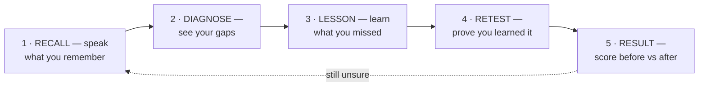

> **Trace:** recall → diagnose → lesson → retest → result (and, if unsure, back
> to recall).

Some rules that keep this simple:

- The **browser decides** when to move from one screen to the next. The server
  never pushes; it only answers requests.
- If the student didn't improve, the loop can go back to step 1 — a fresh
  recall — or loop inside step 4 (retest again) / step 3 (relearn).

---

### 5.2 Chapter ingest — putting content into the system

Before any studying can happen, someone must load a chapter in. This only
happens for admins/seeds, not during a student's session:

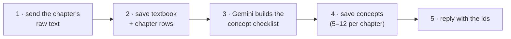

> **Trace:** raw text → saved rows → Gemini extracts concepts → concepts saved →
> ids returned.

```
Sending:   { textbookTitle, subject, title, rawText }
Receiving: { textbookId, chapterId, conceptsExtracted }
Data kept: textbook (1) → chapter (1) → concept_node (5-12)
```

That checklist is the **foundation of everything that follows**: it's what the
AI grades against, what it teaches, and what it re-tests. If the AI ever fails,
the server falls back to a deterministic extraction (sentence splitting + token
matching), so ingest never hard-fails.

---

### 5.3 Starting a study session

Here's the order when a student picks a chapter:

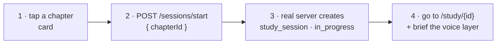

> **Trace:** pick chapter → server opens a session → return `sessionId` →
> navigate to the study screen.

```
Sending:   { chapterId }
Receiving: { sessionId }
Data kept: study_session (1 row, status = "in_progress")
```

No AI call happens here — it's just bookkeeping. All study screens for the rest
of the session use this `sessionId`.

---

### 5.4 Recall — "what do you remember?"

This is the heart of the product. The student speaks out loud; the system
grades their explanation against the concept checklist:

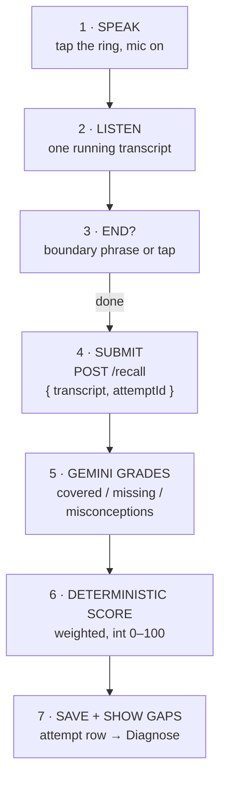

> **Trace:** speak → listen → detect the end → submit → Gemini grades →
> deterministic score → save + show gaps.
>
> **Data kept:** attempt (1 row, stage = "recall")

```
Sending:   { transcriptText, attemptId }
Receiving: { gaps: { covered: [...], missing: [...], misconceptions: [], score: 60 } }
```

A few things worth knowing:

- **What's graded:** covered (explained correctly), missing (never mentioned),
  misconceptions (stated a wrong belief). The score is a **weighted** percentage
  — higher-weight concepts count more, and stating a misconception lowers it.
- **Idempotency:** because every submission carries a random `attemptId`, a
  double-tap, a retry, or a network replay can never create a phantom second
  attempt. The dedup is scoped to the session.
- **Restore on refresh:** if the student reloads the page, the screen rebuilds
  itself from the saved attempts instead of asking the student to recall a
  second time.

**Auto-end detection** details live in section 5.12 below.

---

### 5.5 Diagnose — "here's what's missing"

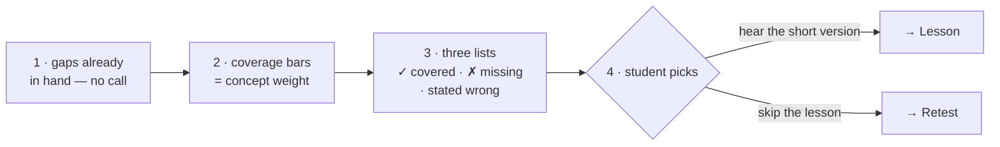

> **Trace:** gaps in hand → weighted bars → three lists → student chooses the
> path. Nothing is saved in this phase — it's a read-only screen.

---

### 5.6 Microlesson — "learn what you missed"

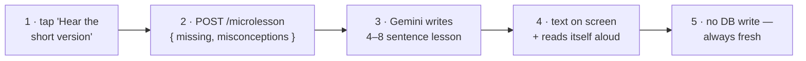

> **Trace:** tap → generate the lesson → show it → speak it. Nothing is saved;
> the lesson is always freshly generated for the specific gaps.

```
Sending:   { missing: [...], misconceptions: [...] }
Receiving: { text: "When current flows through two paths..." }
Data kept: nothing — pure AI generation
```

The read-aloud step uses the agent's natural voice when available, otherwise
the browser's TTS from the "Read it to me" button (see 5.11).

---

### 5.7 Retest — "prove you learned it"

The retest has two parts: generating questions, then grading each answer. One
design goal matters above all: **each question is graded alone against exactly
one concept**, so getting one right can't secretly help the others.

**Part A — Generate the questions:**

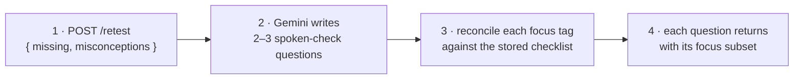

> **Trace:** ask for questions → Gemini writes them → tags are verified →
> canonical focus returned. (Case/whitespace tolerant; an unverifiable tag
> falls back to the gap list — a question never grades against a made-up idea.)

```
Sending:   { missing: [...], misconceptions: [...] }
Receiving: { questions: [ { question: "...", focus: ["..."] }, ... ] }
```

**Part B — Answer each question:**

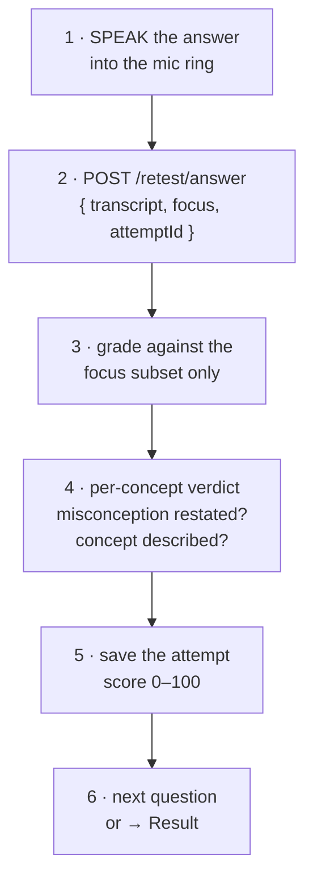

> **Trace:** speak → submit → grade the focus only → verdict → save + score →
> next question.

```
Sending:   { transcriptText, focus: ["..."], attemptId }
Receiving: { score: 100, gaps: { covered, missing, misconceptions, score } }
```

---

### 5.8 Result — "see your improvement"

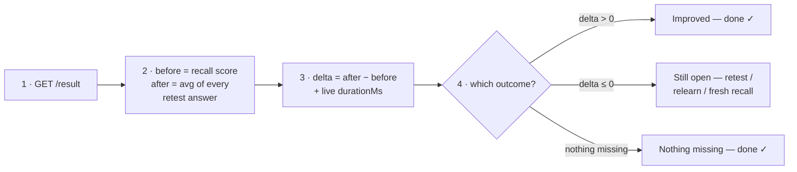

> **Trace:** fetch result → compute the metrics → pick the outcome → suggest the
> next move. After two consecutive no-improvement rounds, the app suggests
> coming back later.

```
Receiving: { before: 60, after: 85, delta: 25, durationMs: 124000 }
Data kept: nothing — reads earlier attempts
```

---

### 5.9 Session end — "I'm done"

The session ends two ways: a button tap or a spoken farewell.

**Path A — Button ("Done for now"):**

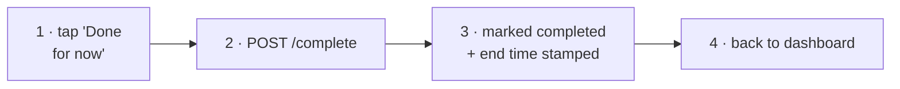

> **Trace:** tap → complete → stamp → dashboard. Unknown session ids get a
> **404**, so a stale "complete" can never blow up a fresh session.

**Path B — Spoken farewell:**

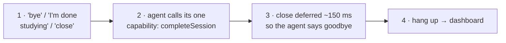

> **Trace:** hear the farewell → one tool call → speak the goodbye → leave. If
> the microphone is mid-answer (a recall being captured), the farewell is **NOT**
> treated as "end session" — it finalizes the answer instead.

```
Sending:   POST /sessions/{id}/complete
Receiving: { ok: true, durationMs: 53659 }
Data kept: study_session UPDATE (status = "completed", completedAt = now)
```

---

### 5.10 Voice agent — a single-job assistant

The voice agent (Voxide) is a conversational assistant that knows **what** the
student is studying (the subject, chapter, and current step) but not the lesson
content or the score breakdown — that detailed thinking stays with Gemini, the
grader. Its only *action* is closing the session.

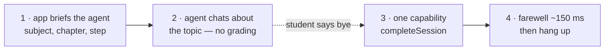

> **Trace:** brief the agent → chat (topic only) → farewell heard → one
> capability → hang up.

Why exactly one capability? Because one source of truth is easier than two.
Everything that *grades* — the recall, the retest answers, the lessons — is
driven by the on-screen loop, so the agent can never create a duplicate attempt
or get out of sync with what's on the screen.

---

### 5.11 Natural voice read-back — replacing robotic TTS

When a lesson arrives it reads itself aloud so the student can follow both the
text and the voice:

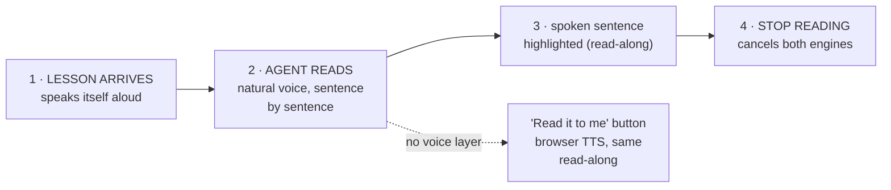

> **Trace:** lesson → natural read → highlight → stop on demand. The browser
> voice is never automatic — it only runs from the explicit button, and a read
> is cut off if the student leaves the screen mid-sentence.

The browser voice (`speakAloud`) picks the least robotic English voice
available and reads at a slightly relaxed pace. A safety beat also keeps it
alive through Chrome's known "paused speech" stall, so a long lesson never
stops mid-sentence.

---

### 5.12 End-of-speech detection — auto-submit without a tap

While the student speaks, the browser watches their transcript for boundary
phrases:

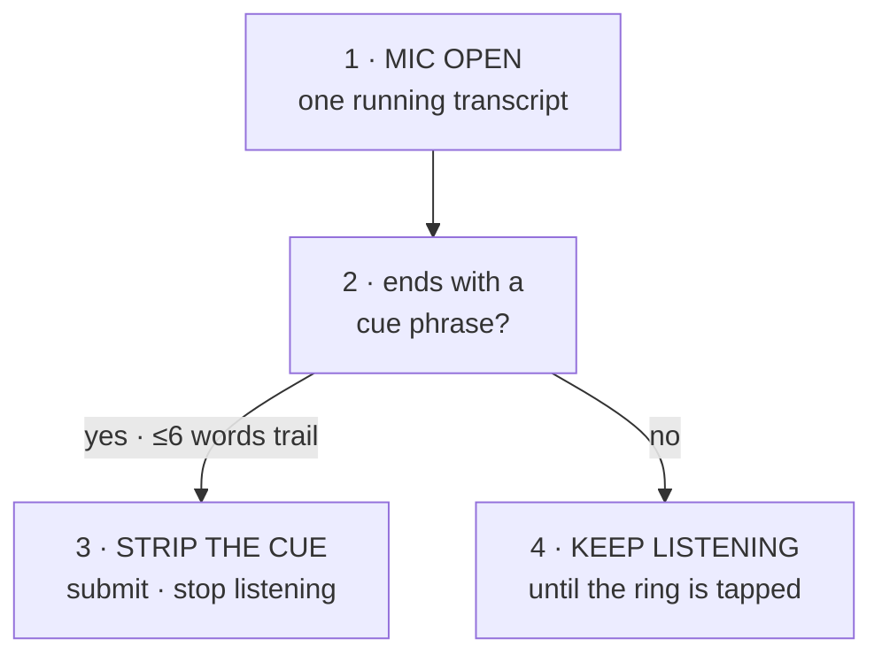

> **Trace:** listen → check for the cue → either submit or keep listening. The
> submitted text is the student's answer; the cue phrase itself is removed
> before submission. (16 cues total — "that's all I remember", "I'm done", "next
> question", ... — defined in `apps/web/src/lib/intent.ts`.)

---

### 5.13 The database — what gets saved

The study domain uses **five tables**, and one row of each means:

| Table | One row = | Key columns |
|---|---|---|
| `textbook` | A real textbook that **belongs to a user** (e.g. "Physics Grade 12") | `ownerId` (→ user), `title`, `subject`, `language` |
| `chapter` | One chapter in a textbook, with its text | `textbookId`, `title`, `rawText` |
| `concept_node` | One idea (or misconception) in the checklist | `chapterId`, `conceptText`, `isMisconception`, `weight` |
| `study_session` | One study attempt on a chapter | `chapterId`, `userId` (→ user), `status`, `startedAt`, `completedAt`, `retestQuestions` (JSON), `retestIndex` |
| `attempt` | One measurement inside a session: the recall, or one retest answer | `id` (client `attemptId`), `sessionId`, `stage`, `transcriptText`, `gapsIdentified` (JSON), `score` |

*Why `retestQuestions` and `retestIndex` exist:* if the student reloads
mid-retest, the server can rebuild the exact question they were on and restore
their answered list — instead of dumping them back into a cold recall. Auth
adds four more tables (`user`, `session`, `account`, `verification`) — see §6.

What each action writes:

- **Chapter ingest** → `textbook` (1) + `chapter` (1) + `concept_node` (5–12)
- **Start session** → `study_session` (1)
- **Recall** → `attempt` (1, stage `"recall"`)
- **Retest answer** → `attempt` (1, stage `"retest"`)
- **Complete** → `study_session` UPDATE (status, completedAt)
- **Microlesson, retest questions, result, history** → nothing (pure AI
  generation or reads)

---

### 5.14 AI prompts — what gets sent to Gemini

Every AI call follows the same shape: one system prompt plus the student's
data, sent as a single message with `temperature: 0.4` and JSON output. Five
different things get asked:

1. **EXTRACT** (chapter ingest) — "Pull the core concepts + common
   misconceptions from this chapter" → `{items: [{conceptText, weight,
   isMisconception}]}`.
2. **GRADE** (recall + retest) — "Judge how well the student's explanation
   covers the checklist" → `{covered: [], missing: [], misconceptions: [],
   score}`.
3. **LESSON** (microlesson) — "Write a short, pronunciation-friendly lesson
   that fixes exactly these gaps" → `{text}`.
4. **RETEST** (retest questions) — "Write 2–3 spoken-check questions that
   re-test the missing concepts; tag each with the targetConcept it tests" →
   `{questions: [{question, targetConcept}]}`.
5. **FOCUS** (per-question verdict) — a deterministic helper, not a prompt: a
   misconception counts as handled when *not* restated; a real concept counts
   when covered. Applied to the question's focus subset only.

Grading never trusts the AI's raw float: every score is recomputed
deterministically server-side using the concept weights. And every prompt has a
fallback — if Gemini fails or the key is a placeholder, deterministic
heuristics take over (token matching for grading, sentence splitting for
concepts, templates for lessons/questions).

---

### 5.15 Complete data flow map — every request

Every API request in the product, who makes it, and whether it touches the AI
or the database. **All of these require a signed-in session** — see §8 for how
that works:

| Endpoint | Called by | AI? | DB write? |
|---|---|---|---|
| `POST /api/auth/*` | Sign-in / sign-up / session | no | yes (auth tables) |
| `GET /api/chapters` | Dashboard | no | no |
| `GET /api/chapters/:id/concepts` | (view only) | no | no |
| `POST /api/chapters/ingest` | Admin / seed | yes | yes |
| `POST /api/sessions/start` | Dashboard | no | yes |
| `GET /api/sessions` | Dashboard (history) | no | no |
| `GET /api/sessions/:id` | StudyProvider | no | no |
| `POST /api/sessions/:id/recall` | StudyProvider | yes | yes |
| `POST /api/sessions/:id/microlesson` | StudyProvider | yes | no |
| `POST /api/sessions/:id/retest` | StudyProvider | yes | no |
| `POST /api/sessions/:id/retest/answer` | StudyProvider | yes | yes |
| `GET /api/sessions/:id/result` | StudyProvider | no | no |
| `POST /api/sessions/:id/complete` | UI + voice agent | no | yes (update) |

The key insight: **the browser UI owns the whole study loop.** The only thing
the voice agent can do is `completeSession` — one endpoint, one job. The
server doesn't care who sent the request.

---

## 6. The database — our data model

A database's design is basically: *what facts do we need to remember, and how do
they relate?* Kiftet has **nine tables** in two families: the five **study-domain**
tables (the product) and the four **auth tables** (who is signed in).

### 6.1 The study domain (5 tables)

| Table | What one row means | Key fields |
|---|---|---|
| `textbook` | A real school textbook (e.g. Physics Grade 12) that a **user owns** | `ownerId` → user, `title`, `subject`, `language` |
| `chapter` | One chapter in that textbook, with its text | `textbookId`, `title`, `rawText` |
| `concept_node` | One object in the chapter's concept checklist — a concept OR a known common misconception | `chapterId`, `conceptText`, `isMisconception`, `weight` (1–5) |
| `study_session` | One study attempt: "student reviews chapter X" | `chapterId`, `userId`, `status` (`in_progress`/`completed`), `startedAt`/`completedAt`, `retestQuestions` (JSON), `retestIndex` |
| `attempt` | One measurement inside a session: the recall, or a retest answer | `id` (client `attemptId`, dedup scoped to session), `sessionId`, `stage` (`recall`/`retest`), `transcriptText`, `gapsIdentified` (JSON `{covered,missing,misconceptions}`), `score` (int 0–100) |

The `concept_node.isMisconception` flag is the interesting one: the product's
whole trick is that we don't just grade "right/wrong," we grade *which specific
concepts didn't stick* — and we pre-warn about the common mistakes students make.

**Ownership / tenant isolation (added with real auth):** every textbook belongs
to the user who ingested it (`textbook.owner_id`). Every server query that lists
or reads chapters, concepts, or sessions filters by the signed-in user, and the
owners are checked when a session starts (`POST /sessions/start` refuses chapters
that aren't yours). Two students can never see each other's material — there's
no "list all rows" anywhere in the API anymore. See §8.

### 6.2 The auth tables (4 tables)

*These tables exist because Better Auth created them (`packages/db/src/schema/auth.ts`). You should never need to touch them, but it helps to know what they hold:*

| Table | One row = | Key fields |
|---|---|---|
| `user` | One account | `id`, `name`, `email` (unique), `emailVerified`, `createdAt` |
| `session` | One logged-in browser | `token` (the hashed session cookie value), `expiresAt`, `userId`, `ipAddress`, `userAgent` |
| `account` | One credential set / provider link | `userId`, `providerId`, `password` (hashed), `accessToken`, `refreshToken` |
| `verification` | One short-lived verification code | `identifier`, `value`, `expiresAt` |

The password is stored **hashed** (never in plain text) inside `account.password`.
"Deleting an account cascades": because `user.id` is referenced with
`ON DELETE CASCADE`, removing a user automatically removes their sessions,
accounts, textbooks, chapters, study sessions, and attempts.

### Relationships (the arrows between tables)

```
textbook 1 ──── n chapter 1 ──── n concept_node
     │                   │
     └─── owner ── n     └─── n study_session 1 ──── n attempt
     user 1 ──── n session
     user 1 ──── n account
```

- One textbook has many chapters; one chapter has many concepts.
- One chapter can appear in many study sessions; one session has one recall
  attempt and one score per retest answer.
- One user owns many textbooks and can have many open sessions.

These "1-to-many" links are stored by a foreign key: a column holding another
table's row id, e.g. `concept_node.chapter_id`. A **foreign key** is just a
promise: "this value must exist in that other table."

### Why SQLite on this branch and Postgres on main
- **SQLite** = one file (`kiftet-dev.db`). No server to install, no credentials,
  works offline, impossible to break. Perfect for iterating fast on the
  prototype.
- **PostgreSQL** = a real database server with users, network access, concurrent
  write safety. That's what production needs when many students hit it at once.

Drizzle lets us switch by changing the driver (the bit that actually talks to the
database). The schema language is ~90% identical, so the swap is cheap. We test
against Postgres on `main` before merge, since main is the "real" app.

### Migrations — the schema's change history
When the schema changes, Drizzle **generates** a SQL file describing the exact
change (`packages/db/src/migrations/*.sql`). Running them upgrades a real
database safely. This is like a version history for your tables — teammates don't
have to manually recreate columns; they just run a migration.

**How migrations actually run here:** there is no "run migrations" step to
remember. `packages/db/src/index.ts` applies every pending `.sql` migration
**automatically on server startup**, so booting the API is the same as migrating
the database. (`PRAGMA journal_mode = WAL` and `PRAGMA foreign_keys = ON` are
also set on boot — WAL for concurrent reads, foreign keys so the cascade
deletes above actually work.)

**How to look at the database yourself:**
```bash
sqlite3 apps/server/kiftet-dev.db ".tables"
sqlite3 apps/server/kiftet-dev.db "select * from study_session order by started_at desc limit 5;"
```
(On `main` with Postgres, use your database console / a Postgres client instead —
the tables are the same names.)

### The current migration history
| Migration | What it changes |
|---|---|
| `0000_lethal_jazinda` | Base schema: all domain + auth tables |
| `0001_retest_resume` | Add `study_session.retest_questions` + `retest_index` |
| `0002_textbook_ownership` | Add `textbook.owner_id`, backfill one owner, index it |

---

## 7. The API surface (what the server can do)

All routes live behind `/api`:

| Method & path | What it does | Phase |
|---|---|---|
| `POST /api/chapters/ingest` | Store a textbook chapter, ready for AI concept extraction | 0 (skeleton) |
| `GET /api/chapters` | List all chapters | 0 |
| `GET /api/chapters/:id/concepts` | View a chapter's concept checklist | 0 |
| `POST /api/sessions/start` | Begin a study session on a chapter | 0 |
| `GET /api/sessions/:id` | Session details + its attempts | 0 |
| `POST /api/sessions/:id/recall` | Submit the student's spoken recall transcript → get gaps | 0/2 (AI in 2) |
| `POST /api/sessions/:id/microlesson` | Get the "teach the gaps" lesson text | 0/2 (AI in 2) |
| `POST /api/sessions/:id/retest` | Get new, differently-phrased questions for the gaps | 0/2 (AI in 2) |
| `POST /api/sessions/:id/retest/answer` | Submit retest answers → updated score | 0/2 (AI in 2) |
| `GET /api/sessions/:id/result` | The before/after coverage delta | 0 |
| `POST /api/sessions/:id/complete` | Mark the session finished | 0 |

In Phase 0, the AI-graded endpoints return **empty placeholders** (empty gaps,
empty questions). The *shape* of the contract is real — the *brains* arrive in
Phase 2.

Every route below is mounted behind the `requireAuth` middleware — a request
without a valid session gets `401` before it ever reaches the route (see §8).

---

## 8. How authentication works — accounts, sessions, cookies

Kiftet uses **Better Auth** (`packages/auth/src/index.ts`): battle-tested
infrastructure so we never have to hand-roll password hashing or session
management. Here's every step.

### 8.1 The sign-up flow

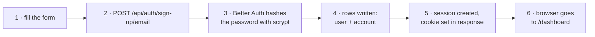

> **Trace:** form → hash → save → session → cookie → dashboard.
>
> **What's stored:** `user` (name, email) + `account` (hashed password). The
> password is **never** stored in plain text — it's hashed with scrypt, a
> memory-hard function designed to make brute-force attacks expensive.

### 8.2 The sign-in flow

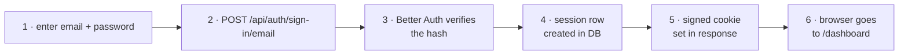

> **Trace:** credentials → verify hash → create session → cookie → dashboard.
>
> **Bad password:** the server returns `401` immediately — no timing leak, no
> extra information about what was wrong.

### 8.3 Every request after login

Once a session exists, the browser sends the **session cookie** with every API
call (`credentials: "include"` in `apps/web/src/lib/api.ts`). Here's what the
server does every time it receives a request:

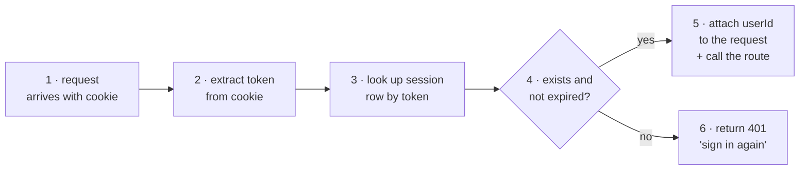

> **Trace:** cookie → token → DB lookup → valid → proceed. The entire auth check
> happens inside `apps/server/src/auth-middleware.ts` before the study router
> even sees the request.

### 8.4 What a session cookie contains

| Property | Value | Why |
|---|---|---|
| Name | `better-auth.session_token` | Better Auth default; you don't choose this |
| Value | A random string that maps to the `session` row | The actual authentication proof |
| `HttpOnly` | `true` | JavaScript in the page can't read it (XSS protection) |
| `Secure` | `true` | Only sent over HTTPS (protects against network sniffing) |
| `SameSite` | `none` | Sends cross-origin — required because the server and client may run on different ports in dev |
| Expires | 7 days (Better Auth default) | Long-lived so the student doesn't have to sign in again on a shared school phone |
| `path` | `/` | Sent with every request on the site |

**Important:** because `Secure: true`, the cookie **only works on HTTPS** in
production. On `localhost` it works because browsers treat localhost as a secure
context automatically.

### 8.5 How the browser knows who's signed in

The web app never reads the cookie directly. Instead, every few seconds it asks
the server for the current session:

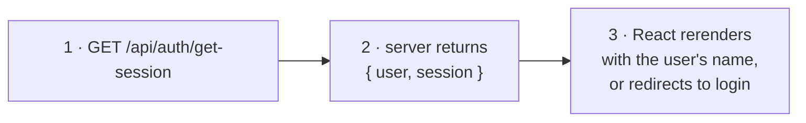

The client (`apps/web/src/lib/auth-client.ts`) sets `baseURL` to
`/api/auth` and adds `credentials: "include"` to every fetch, so the cookie
travels with every call. If the server ever returns 401, the browser redirects
to `/login` — there is no manual check.

### 8.6 Logout

Logout destroys the session row on the server, which means the cookie no longer
matches any session. The browser sends a 401 on the next request and the route
guard redirects to `/login`. No data is deleted — just the current session.

---

## 9. How the browser and server trust each other — CORS, CSRF, origin

When a browser sends a request to a *different* origin (domain or port) the
server must explicitly decide whether to trust it. This is **CORS** (Cross-Origin
Resource Sharing).

### 9.1 CORS_ORIGIN — the trusted origin

Every server deploy sets one environment variable for this: `CORS_ORIGIN`. This
is the **single origin** the server trusts for state-changing requests (POST,
PUT, DELETE). During build or config this value is normalized:

```
https://app.example.com/  →  https://app.example.com   (trailing slash stripped)
https://app.example.com,http://localhost:3000           (comma-separated = multiple)
```

This normalized list is fed to both the Express `cors` middleware (for the
`Access-Control-Allow-Origin` header) and to Better Auth's `trustedOrigins`.

### 9.2 Preflight — the OPTIONS request

Before the browser sends a POST to a cross-origin server, it sends an `OPTIONS`
request ("preflight") to ask permission. The server's CORS config replies:

```
Access-Control-Allow-Origin: https://app.example.com
Access-Control-Allow-Methods: GET, POST, OPTIONS
Access-Control-Allow-Headers: Content-Type, Authorization
Access-Control-Allow-Credentials: true
```

If the origin doesn't match any in the configured list, the server replies with
no `Access-Control-Allow-Origin` header, and the browser blocks the request
entirely — cookies never travel.

### 9.3 Why `credentials: "include"` matters

By default, browsers don't send cookies cross-origin. Adding `credentials:
"include"` to the fetch options tells the browser: "yes, attach cookies even
though the origin is different." The server must then reply with
`Access-Control-Allow-Credentials: true` — otherwise the browser still blocks
the cookie.

### 9.4 Origin check on writes (extra protection beyond CORS)

CORS protects the **browser**. But a direct curl or a script that ignores CORS
could still POST to the server. That's why `requireAuth` (§8) does an
**additional origin check** on every non-GET request:

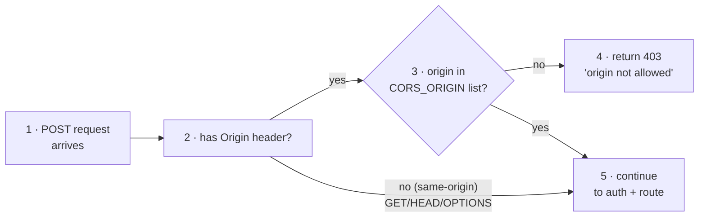

This catches a class of CSRF (Cross-Site Request Forgery) attack where a
malicious site tricks a logged-in user's browser into POSTing data to our
server. The origin header the browser sends (if any) won't match our list.

### 9.5 What `sameSite: "none"` means for the cookie

`samesite: none` means the session cookie is sent with **any** cross-origin
request — which is exactly what we need for the React app talking to the API on
a different origin. The cost: `samesite: none` also allows the cookie in
third-party embeds. We mitigate this by requiring HTTPS (`secure: true`) and
rejecting any non-trusted origin in the middleware.

---

## 10. Policies, limits, and guards

These are the invisible walls that keep the product from being misused or
overloaded. Every one of them is applied server-side; the client is never trusted
to police itself.

### 10.1 Ownership / tenant isolation

**Principle:** a user can only see their own data.

Every query that returns chapters, concepts, sessions, or results filters by
the signed-in user's `userId`. The chapter ingest path stamps the new textbook
with `owner_id = currentUser`. When a session starts, the server verifies that
the requested `chapterId` belongs to a textbook owned by that user — returning
`404` otherwise. Two students sharing a login would still only see one set of
chapters; two separate accounts see nothing of each other.

### 10.2 AI rate limiting (in-memory)

Every AI-grading call (`recall`, `microlesson`, `retest`, `retest/answer`) and
chapter ingest is rate-limited at **30 requests per user per minute**, tracked
in an in-memory `Map`. When the limit is hit the server returns `429 Too Many
Requests`.

This is the *only* rate limiter; plain reads (chapters, sessions, results) are
unlimited. In-memory means the counter resets on server restart — this is a
safety net, not a billing system.

### 10.3 Request size limits

The server rejects HTTP request bodies larger than **256 KB**
(`express.json({ limit: '256kb' })`). Transcript submissions are individually
capped at **20,000 characters** via Zod validation, and concept text is capped
at **500 characters**. These prevent accidental upload of an entire textbook or
a pathological prompt.

### 10.4 Idempotency — no phantom duplicates

Every submission carries a **client-generated `attemptId`** (a random UUID). The
server calls `INSERT ... ON CONFLICT DO NOTHING` — if a network retry sends the
same attempt twice, the duplicate is silently dropped and the first score is
returned. The dedup is scoped to the session, so different sessions can have the
same `attemptId` without conflict.

### 10.5 Retest ordering

The server tracks `study_session.retestIndex` — the ordinal of the next
unanswered retest question. If a client sends an answer for question 3 when
question 2 is still open, the server rejects it with `409 Conflict`. This keeps
the grading pipeline strict and prevents clients from submitting answers out of
order after a page reload.

### 10.6 Env-based mode switching

| Variable | Effect |
|---|---|
| `NODE_ENV=development` | Verbose errors, relaxed cookie policy |
| `NODE_ENV=production` | HTTPS-only cookies, no stack traces in error responses |
| `VITE_SERVER_URL` not set in production | loud console.error on client, API calls fail visibly |
| `CORS_ORIGIN` wrong or missing | every login silently fails (cookie never attaches) |

---

## 11. Environment variables — every env var and what it does

Every env var used by the system, where it's set, and what happens if it's
wrong.

| Variable | Where | What | Wrong = |
|---|---|---|---|
| `NODE_ENV` | Server, web | `development` / `production` / `test` | Dev-only features exposed in prod, or vice versa |
| `BETTER_AUTH_SECRET` | Server | Random string (≥32 chars), the master signing key for session tokens | Sessions rejected, every login 500s |
| `BETTER_AUTH_URL` | Server | The public URL of the API (e.g. `https://api.kiftet.com`) | Session cookie points to the wrong domain |
| `CORS_ORIGIN` | Server | Comma-separated trusted origins (e.g. `https://app.kiftet.com`) | Browser silently blocks every POST, login loop |
| `DATABASE_FILE` | Server (SQLite only) | Path to the `.db` file (e.g. `./kiftet-dev.db`) | Server crashes on boot |
| `DATABASE_URL` | Server (Postgres only) | Postgres connection string | Server crashes on boot |
| `DATABASE_URL_DIRECT` | DB package | Direct (non-pooled) Postgres connection for migrations | Migrations fail, schema stale |
| `GEMINI_API_KEY` | Server | Google Gemini API key | Grading returns empty placeholders; lessons fallback to templates |
| `VITE_SERVER_URL` | Web (client) | Root URL of the API (no `/api` suffix); falls back to `localhost:3000` in dev | All API calls 404; loud console warning in production |
| `VITE_VOXIDE_KEY` | Web (client) | Voxide publishable key | Voice features disabled; typed fallback activates |

**How to set them:**
- **Local dev:** every package has a `.env.schema` file with safe placeholder
  values; `bun run env:generate` reads the schema and produces TypeScript types
  (`apps/server/src/env.ts`, `packages/db/src/env.ts`). Fill in real values
  in a `.env` file (never committed).
- **Production (hosting platform):** set the same variable names as environment
  secrets — Varlock reads them at build and runtime automatically.

---

## 12. Design decisions worth remembering

1. **Voice is the core, not a bolt-on.** The PRD says Voxide is the mechanic —
   capture the student's explanation, speak the lesson. So we build the voice
   spine early (Phase 1), even though the AI brains come later (Phase 2).

2. **AI sits behind one seam.** Only `apps/server/src/ai/gemini.ts` knows the
   vendor. If we need a fallback chain (OpenAI, Anthropic) or if costs change,
   we change one file. The system design explicitly calls for a fallback chain
   so a provider outage can't kill a live demo.

3. **Concept extraction is cached per chapter.** We AI-extract concepts once when
   a chapter is ingested, store them in `concept_node`, and **never re-run the
   expensive AI call during a live session**. The demo must not depend on a slow
   API call while judges watch.

4. **Mobile-first, calm design.** Night Indigo `#1B2340` + Meskel Gold `#E8A33D`
   is the identity. The voice state ("Listening…", "Thinking…") is a first-class
   UI element — a student has to trust the app is hearing them. The one place we
   spend visual boldness is the gap visualization: show *which* concepts are
   covered vs missing, not just "62%".

5. **Institutional licensing, not per-student fees** (B2B2C). Schools and
   tutoring centers pay; students get it free. Real deal with Links.et sponsor.

6. **Two explicitly-risky things are tested early, not discovered late:**
   grading a *conceptual* explanation vs. grading a *numerical* answer likely
   need different prompts/logic — we test both on real chapter types (Phase 4).

---

## 13. Where we are (roadmap)

| Phase | Name | Status |
|---|---|---|
| 0 | Skeleton — SQLite domain, API shell, AI seam | ✅ Done |
| 1 | Voice spine — Voxide capture/playback + voice-state UI | ⏭️ Next |
| 2 | AI loop — real Gemini: extraction, grading, micro-lessons, retest | ⛔ |
| 3 | Web flow — Web recall→gap→lesson→retest screens | ✅ |
| 4 | Demo dataset + polish | ⛔ |
| 5 | Deploy (EthioDeploy) + Postgres switch | ⛔ |

> **The voice seam, honestly.** The SDK owns the orb + its word-by-word
> caption (no hide flag in `VoxideAppearance`). We never bet the platform on
> that: real grading reads only **finalized** turns (the same `!m.partial`
> gate as the captions' own bubbles), and the calm replies + read-back come
> from the browser natively — `speechSynthesis` for reading our reply aloud,
> no vendor TTS-commit. Voice = the seam; Gemini + text = load-bearing.

The rule that runs this branch: **build one phase, test it, fix it, write the
testing guide, only then start the next.** Nobody ever fires all phases at once —
each phase is a checkpoint.

---

## 14. How to run everything yourself

```bash
# 1. Install dependencies
bun install

# 2. Regenerate env types (varlock reads .env.schema → TS)
bun run env:generate

# 3. Start the backend
bun run --cwd apps/server dev        # → http://localhost:3000

# 4. Start the web app (different terminal)
bun run --cwd apps/web dev           # → http://localhost:5173
```

The server creates `kiftet-dev.db` on first run (that's the whole SQLite
"database") and applies migrations automatically.

## 15. Everything we use — the source-of-truth inventory

This section is the audit trail for the whole repo. Every feature and every
package (dependency **and** dev-dependency) is listed here, cross-checked
against the `package.json` files and source. **Rule of repo:** if you add a
package or a feature, add a row here; if a row stops being true, fix the row.

### 15.1 Feature index

| Feature | Section | Where it lives (key files) | API |
|---|---|---|---|
| Study loop (the master state) | §5.1 | `apps/web/src/components/study-provider.tsx` | — |
| Dashboard + last-session history | §5.3 | `apps/web/src/routes/dashboard.tsx` | `GET /chapters`, `GET /sessions` |
| Recall ("what do you remember?") | §5.4 | `apps/web/src/routes/study.$sessionId.tsx` (RecallPhase) | `POST /sessions/:id/recall` |
| Diagnose (gap chips + bars) | §5.5 | `study.$sessionId.tsx` (DiagnosePhase) | — |
| Microlesson + read-aloud | §5.6 | `study.$sessionId.tsx` (LessonPhase), `lib/voice.ts` | `POST /sessions/:id/microlesson` |
| Retest (questions + per-focus grading) | §5.7 | `study.$sessionId.tsx` (RetestPhase) | `POST /sessions/:id/retest`, `POST /sessions/:id/retest/answer` |
| Result (before/after/delta) | §5.8 | `study.$sessionId.tsx` (ResultPhase) | `GET /sessions/:id/result` |
| End session (button + voice) | §5.9 | `components/assistant.tsx` (the `completeSession` capability) | `POST /sessions/:id/complete` |
| Voice chat with the agent | §5.10 | `components/assistant.tsx` | WebSocket via `@voxide/react` |
| Natural read-back (read-along) | §5.11 | `lib/voice.ts`, `components/assistant.tsx` | — |
| Auto end-of-speech detection | §5.12 | `lib/intent.ts`, `lib/voice.ts` | — |
| Auth (sign in / sign up / session cookie) | §8 | `packages/auth`, `lib/auth-client.ts`, `components/sign-in-form.tsx`, `sign-up-form.tsx` | Better Auth `/api/auth/*` |
| CORS / CSRF origin guard | §9 | `apps/server/src/index.ts` (cors), `apps/server/src/auth-middleware.ts` | — |
| Ownership / tenant isolation | §10.1 | `apps/server/src/routes/study.ts` (every query filtered by userId) | — |
| AI rate limiting | §10.2 | `apps/server/src/routes/study.ts` (`allowAiRequest`) | — |
| Idempotent submissions | §10.4 | `apps/server/src/routes/study.ts` (`insertAttemptOnce`) | — |
| Retest resume on reload | §5.13 | `study.$sessionId.tsx`, `study-provider.tsx`, server `/sessions/:id` | — |
| Themes (dark/light/forest/gold) | §4 | `components/theme-provider.tsx`, `components/theme-switcher.tsx` | — |
| Offline / installable (PWA) | §4 | `apps/web/vite.config.ts`, `public/offline.html` | — |
| AI grading, lessons, questions | §5.4–5.8 | `apps/server/src/routes/study.ts`, `apps/server/src/ai/gemini.ts` | (server-side) |

### 15.2 Dependency inventory

**Runtime deps** — shipped with the product:

| Package | Lives in | What it's literally used for |
|---|---|---|
| `react`, `react-dom` (19) | apps/web, packages/ui | The UI framework. |
| `react-router` + `@react-router/fs-routes` + `@react-router/node` + `@react-router/serve` | apps/web | URL → screen routing, file-based routes, SSR server, static serving. |
| `@tanstack/react-form` | apps/web | Typed forms for sign-in and sign-up. |
| `@voxide/react` | apps/web | The voice session: speech-to-text (hears the student) and the agent's natural text-to-speech. |
| `better-auth` | apps/web, apps/server, packages/auth | Authentication: credentials, sessions, cookies, and the client hooks. |
| `isbot` | apps/web | Bot detection for SSR. |
| `lucide-react` | apps/web, packages/ui | All the icons. |
| `next-themes` | apps/web, packages/ui | Dark/light theme state. |
| `sonner` | apps/web, packages/ui | Toast notifications. |
| `varlock` | apps/web, apps/server, packages/db | Typesafe environment variables (`.env` → generated TS). |
| `@varlock/vite-integration` | apps/web | Feeds the generated env types into Vite. |
| `zod` | every package | Runtime validation of API bodies, responses, and env. |
| `vite-plugin-pwa` | apps/web | Makes the app installable and offline-capable. |
| `express`, `cors` | apps/server | The HTTP API and cross-origin policy. |
| `@google/genai` | apps/server | The Gemini SDK — the only AI door in the system. |
| `drizzle-orm` | apps/server, packages/db | Typesafe SQL (schema, queries, and auto-migrations on startup via `drizzle-orm/bun-sqlite`). |
| `@neondatabase/serverless` | packages/db | Postgres driver for the production (`main`) branch's Lakebase/Neon database. |
| `@shadcn/react`, `@base-ui/react`, `class-variance-authority`, `cn`, `tw-animate-css` | packages/ui | The UI kit: shadcn/ui components built on Base UI primitives, style variants, and animated transitions. |
| `shadcn` | packages/ui | The component source-of-truth for scaffolding/copying UI components. |

**Dev / build deps** — only on our machines:

| Package | Lives in | What it's literally used for |
|---|---|---|
| `bun` (runtime) | root | Package manager + runtime; also *is* the SQLite driver (`bun:sqlite`). |
| `typescript` + `@types/*` (bun, node, react, react-dom, cors, express) | root + packages | The compiler for `check-types` and ambient types. |
| `turbo` | root | Runs builds/tasks across all packages with caching. |
| `@biomejs/biome` | root | Lint + format (replaces ESLint + Prettier). |
| `tsdown` | apps/server | Bundles the server into a standalone `dist`. |
| `vite`, `@tailwindcss/vite`, `tailwindcss`, `@tailwindcss/postcss` | apps/web, packages/ui | Dev server + build + CSS compilation (Tailwind v4). |
| `@react-router/dev` | apps/web | React Router's dev server and build pipeline. |
| `drizzle-kit` | packages/db | Schema → migration SQL generation. |
| `@vite-pwa/assets-generator` | apps/web | Generates the PWA icon set. |
| `@kiftet/config` | packages/config | Shared TypeScript project config used by the workspace. |
| `varlock` | root + packages/db | Env-schema codegen tooling. |

> **Reading note:** `bun run check-types` (TypeScript) and `bun run build`
> (Turborepo) are the gates that prove this inventory is wired together correctly.

---

- **API** — the agreed list of operations one program exposes to another.
- **JSON** — a readable text format for sending structured data.
- **Route / endpoint** — a URL + method the server handles, e.g. `GET /api/chapters`.
- **Middleware** — code that runs *around* every request (e.g. CORS, JSON parsing).
- **Foreign key** — a column that points at another table's row, linking them.
- **Migration** — a recorded, replayable change to the database schema.
- **ORM** — a tool that lets you write database queries in your programming
  language instead of raw SQL (Drizzle).
- **Seeder / ingest** — code that puts starting data (chapters) into the DB.
- **STT / TTS** — speech-to-text (hear) and text-to-speech (speak).
- **PWA** — a website that can be installed and works offline like an app.
- **Separation of concerns** — splitting a system so each part has one job and
  only talks to others through clear interfaces.
- **Cookie** — a small key/value a server tells the browser to remember and send
  back with every subsequent request. Our session cookie is how the server knows
  "this request is from who signed in on that phone."
- **Session** — in our app, a row in the `session` table representing one
  logged-in browser. The cookie value maps to a session row; the row says when it
  expires and which user owns it.
- **Hash / hashing** — turning a value into a one-way fingerprint. Passwords are
  stored hashed (with scrypt) so even the database leaking can't reveal them.
- **Origin** — scheme + host + port, e.g. `https://app.kiftet.com`. Browsers use
  origins, not just domains, to decide what to trust.
- **CORS** — "Cross-Origin Resource Sharing"; the rules a server publishes for
  *which other origins* may call it. See §9.
- **CSRF** — "Cross-Site Request Forgery"; a hostile website tricking your
  browser into sending an authenticated request to a site you trust. We defend
  against it by verifying the Origin header (§9.4).
- **Rate limit** — capping how many times something can happen per unit of time
  (e.g. 30 AI calls per user per minute) so one user can't overload the system.
- **Idempotency** — doing the same operation twice has no extra effect. Our
  duplicate-recognizing `attemptId` makes a network retry harmless (§10.4).
- **Health check** — a ping endpoint (`GET /`) that monitoring systems hit to
  confirm the server is alive.