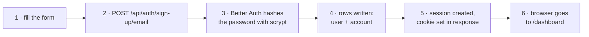
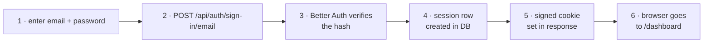
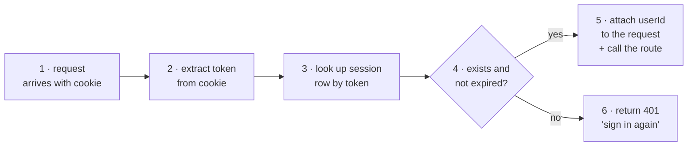
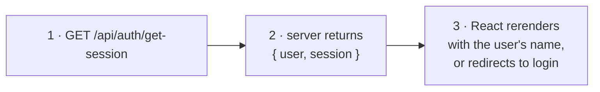

# How Kiftet Works — authentication

> Part of the [how-it-works index](README.md).

Kiftet uses **Better Auth** (`packages/auth/src/index.ts`): battle-tested
infrastructure so we never have to hand-roll password hashing or session
management. Here's every step.

### 8.1 The sign-up flow

> **Trace:** form → hash → save → session → cookie → dashboard.
>
> **What's stored:** `user` (name, email) + `account` (hashed password). The
> password is **never** stored in plain text — it's hashed with scrypt, a
> memory-hard function designed to make brute-force attacks expensive.

### 8.2 The sign-in flow

> **Trace:** credentials → verify hash → create session → cookie → dashboard.
>
> **Bad password:** the server returns `401` immediately — no timing leak, no
> extra information about what was wrong.

### 8.3 Every request after login

Once a session exists, the browser sends the **session cookie** with every API
call (`credentials: "include"` in `apps/web/src/lib/api.ts`). Here's what the
server does every time it receives a request:

> **Trace:** cookie → token → DB lookup → valid → proceed. The entire auth check
> happens inside `apps/server/src/auth-middleware.ts` before the study router
> even sees the request.

### 8.4 What a session cookie contains

| Property | Value | Why |
|---|---|---|
| Name | `better-auth.session_token` | Better Auth default; you don't choose this |
| Value | A random string that maps to the `session` row | The actual authentication proof |
| `HttpOnly` | `true` | JavaScript in the page can't read it (XSS protection) |
| `Secure` | `true` | Only sent over HTTPS (protects against network sniffing) |
| `SameSite` | `none` | Sends cross-origin — required because the server and client may run on different ports in dev |
| Expires | 7 days (Better Auth default) | Long-lived so the student doesn't have to sign in again on a shared school phone |
| `path` | `/` | Sent with every request on the site |

**Important:** because `Secure: true`, the cookie **only works on HTTPS** in
production. On `localhost` it works because browsers treat localhost as a secure
context automatically.

### 8.5 How the browser knows who's signed in

The web app never reads the cookie directly. Instead, every few seconds it asks
the server for the current session:

The client (`apps/web/src/lib/auth-client.ts`) sets `baseURL` to
`/api/auth` and adds `credentials: "include"` to every fetch, so the cookie
travels with every call. If the server ever returns 401, the browser redirects
to `/login` — there is no manual check.

### 8.6 Logout

Logout destroys the session row on the server, which means the cookie no longer
matches any session. The browser sends a 401 on the next request and the route
guard redirects to `/login`. No data is deleted — just the current session.

---

