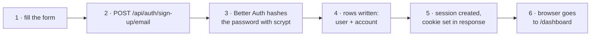
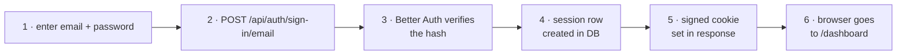
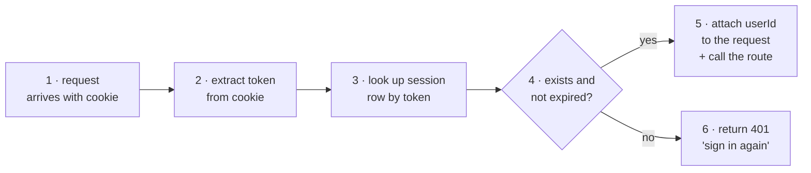
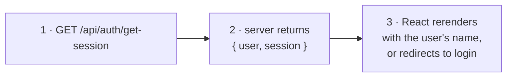
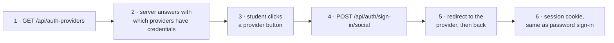

# How Kiftet Works — authentication

> Part of the [how-it-works index](README.md).

Kiftet uses **Better Auth** (`packages/auth/src/index.ts`): battle-tested
infrastructure so we never have to hand-roll password hashing or session
management. Here's every step.

### 8.1 The sign-up flow

```mermaid
flowchart LR
  A["1 · fill the form"] --> B["2 · POST /api/auth/sign-up/email"]
  B --> C["3 · Better Auth hashes\nthe password with scrypt"]
  C --> D["4 · rows written:\nuser + account"]
  D --> E["5 · session created,\ncookie set in response"]
  E --> F["6 · browser goes\nto /dashboard"]
```

> **Trace:** form → hash → save → session → cookie → dashboard.
>
> **What's stored:** `user` (name, email) + `account` (hashed password). The
> password is **never** stored in plain text — it's hashed with scrypt, a
> memory-hard function designed to make brute-force attacks expensive.

### 8.2 The sign-in flow

```mermaid
flowchart LR
  A["1 · enter email + password"] --> B["2 · POST /api/auth/sign-in/email"]
  B --> C["3 · Better Auth verifies\nthe hash"]
  C --> D["4 · session row\ncreated in DB"]
  D --> E["5 · signed cookie\nset in response"]
  E --> F["6 · browser goes\nto /dashboard"]
```

> **Trace:** credentials → verify hash → create session → cookie → dashboard.
>
> **Bad password:** the server returns `401` immediately — no timing leak, no
> extra information about what was wrong.

### 8.3 Every request after login

Once a session exists, the browser sends the **session cookie** with every API
call (`credentials: "include"` in `apps/web/src/lib/api.ts`). Here's what the
server does every time it receives a request:

```mermaid
flowchart LR
  A["1 · request\narrives with cookie"] --> B["2 · extract token\nfrom cookie"]
  B --> C["3 · look up session\nrow by token"]
  C --> D{"4 · exists and\nnot expired?"}
  D -->|"yes"| E["5 · attach userId\nto the request\n+ call the route"]
  D -->|"no"| F["6 · return 401\n'sign in again'"]
```

> **Trace:** cookie → token → DB lookup → valid → proceed. The entire auth check
> happens inside `apps/server/src/auth-middleware.ts` before the study router
> even sees the request.

### 8.4 What a session cookie contains

| Property | Value | Why |
|---|---|---|
| Name | `better-auth.session_token` | Better Auth default; you don't choose this |
| Value | A random string that maps to the `session` row | The actual authentication proof |
| `HttpOnly` | `true` | JavaScript in the page can't read it (XSS protection) |
| `Secure` | `true` | Only sent over HTTPS (protects against network sniffing) |
| `SameSite` | `none` | Sends cross-origin — required because the server and client may run on different ports in dev |
| Expires | 7 days (Better Auth default) | Long-lived so the student doesn't have to sign in again on a shared school phone |
| `path` | `/` | Sent with every request on the site |

**Important:** because `Secure: true`, the cookie **only works on HTTPS** in
production. On `localhost` it works because browsers treat localhost as a secure
context automatically.

### 8.5 How the browser knows who's signed in

The web app never reads the cookie directly. Instead, every few seconds it asks
the server for the current session:

```mermaid
flowchart LR
  A["1 · GET /api/auth/get-session"] --> B["2 · server returns\n{ user, session }"]
  B --> C["3 · React rerenders\nwith the user's name,\nor redirects to login"]
```

The client (`apps/web/src/lib/auth-client.ts`) sets `baseURL` to
`/api/auth` and adds `credentials: "include"` to every fetch, so the cookie
travels with every call. If the server ever returns 401, the browser redirects
to `/login` — there is no manual check.

### 8.6 Logout

Logout destroys the session row on the server, which means the cookie no longer
matches any session. The browser sends a 401 on the next request and the route
guard redirects to `/login`. No data is deleted — just the current session.

---

### 8.7 Signing in with Google or Facebook

Two ways in, not one. The password form above is the floor — it needs nothing
configured and is the only path that works on a brand-new install. Social
buttons appear **only** when the server reports that provider configured:

```mermaid
flowchart LR
  A["1 · GET /api/auth-providers"] --> B["2 · server answers with\nwhich providers have credentials"]
  B --> C["3 · student clicks\na provider button"]
  C --> D["4 · POST /api/auth/sign-in/social"]
  D --> E["5 · redirect to the\nprovider, then back"]
  E --> F["6 · session cookie,\nsame as password sign-in"]
```

The endpoint returns provider **ids only** — no client id, no secret. It exists
so a button can never disagree with the config: `enabledSocialProviders()` in
`packages/auth/src/providers.ts` decides both the button list and the Better
Auth provider list, so registering credentials makes a button appear with no
frontend edit, and a half-configured provider (an id with no secret) is treated
as absent rather than as a button that bounces a student to a provider error.

**Why Facebook is the important one here.** Meta's own figures put Facebook
accounts in Ethiopia at 9.8M against 29.5M internet users nationwide — it is
the account a student is most likely to already have, and it costs nothing to
offer. Two Facebook-specific details are handled in `providers.ts`:

- Meta omits the email address entirely for **phone-only accounts** and revoked
  consent, both ordinary in this market. `mapProfileToUser` falls back to the
  profile id so the sign-in completes instead of failing.
- Meta's Graph API exposes **no per-email verification flag**, so Facebook is
  deliberately not gated on `requireEmailVerification`. Google *does* report it
  and is the provider to gate the day email verification is switched on.

`accountLinking` trusts both providers so a student who signs up with Facebook
and later tries Google with the same address lands on the one account rather
than a fresh one with their study history missing. `allowDifferentEmails` stays
`false` so an unverified address can never be used to walk into an existing
account.

### 8.8 Upgrading Better Auth

`better-auth` is pinned to an **exact** version in the root `package.json`
(`workspaces.catalog`) — it is the only entry in that catalog without a `^`,
and that is deliberate. Better Auth's option surface changes between minors, and
a renamed option fails at **boot**, not at compile time: TypeScript is happy,
`bun run dev` is not.

Three things hold that line, and all three are load-bearing:

1. **The exact pin.** No range means an install cannot float to a version whose
   options moved. A test asserts the pin is still exact and still matches the
   installed version, so widening it to a range fails in CI instead of quietly
   disabling the guard at the next deploy.
2. **Resolved-config tests** (`packages/auth/src/index.test.ts`). These read
   `auth().$context.options` — the *resolved* object Better Auth actually
   built — rather than our source, so an option it no longer accepts shows up as
   a wrong value instead of silently disappearing.
3. **Dependabot** (`.github/dependabot.yml`), weekly, grouping Better Auth with
   Drizzle and Neon so the auth stack is reviewed and tested as one change.

When a bump arrives, the procedure is: read the release notes for breaking
changes → bump the pin → run `bun run test` → run `bun run check-types` and
`bun run dev` → sign in with **password, Google, and Facebook** → only then
merge. The social paths are the ones an upgrade is most likely to break
silently, because they depend on provider-shaped profile data that no type
check sees. Do not merge a bump that has only been proven to work by logging in
with a password.
