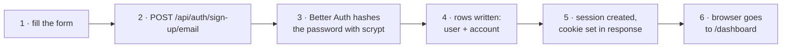
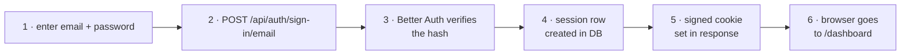
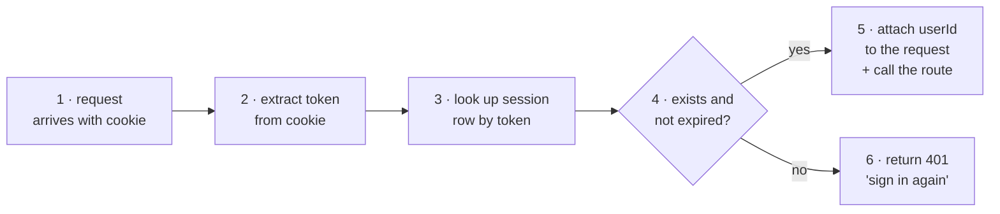
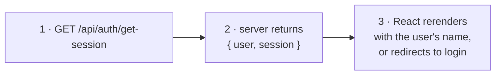
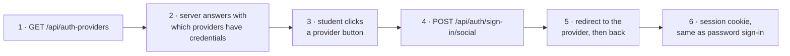

# How Kiftet Works — authentication

> Part of the [how-it-works index](README.md).


Kiftet uses **Better Auth** (`packages/auth/src/index.ts`): battle-tested
infrastructure so we never have to hand-roll password hashing or session
management. Here's every step.

### 8.1 The sign-up flow


```mermaid
flowchart LR
  A["1 · fill the form"] --> B["2 · POST /api/auth/sign-up/email"]
  B --> C["3 · Better Auth hashes\nthe password with scrypt"]
  C --> D["4 · rows written:\nuser + account"]
  D --> E["5 · session created,\ncookie set in response"]
  E --> F["6 · browser goes\nto /dashboard"]
```

> **Trace:** form → hash → save → session → cookie → dashboard.
>
> **What's stored:** `user` (name, email) + `account` (hashed password). The
> password is **never** stored in plain text — it's hashed with scrypt, a
> memory-hard function designed to make brute-force attacks expensive.

### 8.2 The sign-in flow


```mermaid
flowchart LR
  A["1 · enter email + password"] --> B["2 · POST /api/auth/sign-in/email"]
  B --> C["3 · Better Auth verifies\nthe hash"]
  C --> D["4 · session row\ncreated in DB"]
  D --> E["5 · signed cookie\nset in response"]
  E --> F["6 · browser goes\nto /dashboard"]
```

> **Trace:** credentials → verify hash → create session → cookie → dashboard.
>
> **Bad password:** the server returns `401` immediately — no timing leak, no
> extra information about what was wrong.

### 8.3 Every request after login

Once a session exists, the browser sends the **session cookie** with every API
call (`credentials: "include"` in `apps/web/src/lib/api.ts`). Here's what the
server does every time it receives a request:


```mermaid
flowchart LR
  A["1 · request\narrives with cookie"] --> B["2 · extract token\nfrom cookie"]
  B --> C["3 · look up session\nrow by token"]
  C --> D{"4 · exists and\nnot expired?"}
  D -->|"yes"| E["5 · attach userId\nto the request\n+ call the route"]
  D -->|"no"| F["6 · return 401\n'sign in again'"]
```

> **Trace:** cookie → token → DB lookup → valid → proceed. The entire auth check
> happens inside `apps/server/src/auth-middleware.ts` before the study router
> even sees the request.

### 8.4 What a session cookie contains

| Property | Value | Why |
|---|---|---|
| Name | `better-auth.session_token` | Better Auth default; you don't choose this |
| Value | A random string that maps to the `session` row | The actual authentication proof |
| `HttpOnly` | `true` | JavaScript in the page can't read it (XSS protection) |
| `Secure` | `true` | Only sent over HTTPS (protects against network sniffing) |
| `SameSite` | `none` | Sends cross-origin — required because the server and client may run on different ports in dev |
| Expires | 7 days (Better Auth default) | Long-lived so the student doesn't have to sign in again on a shared school phone |
| `path` | `/` | Sent with every request on the site |

**Important:** because `Secure: true`, the cookie **only works on HTTPS** in
production. On `localhost` it works because browsers treat localhost as a secure
context automatically.

### 8.5 How the browser knows who's signed in

The web app never reads the cookie directly. Instead, every few seconds it asks
the server for the current session:


```mermaid
flowchart LR
  A["1 · GET /api/auth/get-session"] --> B["2 · server returns\n{ user, session }"]
  B --> C["3 · React rerenders\nwith the user's name,\nor redirects to login"]
```

The client (`apps/web/src/lib/auth-client.ts`) sets `baseURL` to
`/api/auth` and adds `credentials: "include"` to every fetch, so the cookie
travels with every call. If the server ever returns 401, the browser redirects
to `/login` — there is no manual check.

### 8.6 Logout

Logout destroys the session row on the server, which means the cookie no longer
matches any session. The browser sends a 401 on the next request and the route
guard redirects to `/login`. No data is deleted — just the current session.

---

### 8.7 Signing in with Google, Facebook or GitHub

Password sign-in is the baseline and needs no provider credentials. Google,
Facebook and GitHub are optional ways in; each social button appears **only**
when the server reports both credentials for that provider:


```mermaid
flowchart LR
  A["1 · GET /api/auth-providers"] --> B["2 · server answers with\nwhich providers have credentials"]
  B --> C["3 · student clicks\na provider button"]
  C --> D["4 · POST /api/auth/sign-in/social"]
  D --> E["5 · redirect to the\nprovider, then back"]
  E --> F["6 · session cookie,\nsame as password sign-in"]
```

The endpoint returns provider **ids only** — no client id, no secret. It exists
so a button can never disagree with the config: `enabledSocialProviders()` in
`packages/auth/src/providers.ts` decides both the button list and the Better
Auth provider list, so registering credentials makes a button appear with no
frontend edit, and a half-configured provider (an id with no secret) is treated
as absent rather than as a button that bounces a student to a provider error.

**Why GitHub is offered.** Google rejects OAuth apps on some deployment
domains that are not on the Public Suffix List, including the current
EthioDeploy domain. GitHub OAuth does not impose that same domain restriction
and can provide a working social-login path there. It requests `read:user` and
`user:email`; configure both `GITHUB_CLIENT_ID` and `GITHUB_CLIENT_SECRET` on
the API service. Its callback is
`<BETTER_AUTH_URL>/api/auth/callback/github`.

**Why Facebook is the important one here.** Meta's own figures put Facebook
accounts in Ethiopia at 9.8M against 29.5M internet users nationwide — it is
the account a student is most likely to already have, and it costs nothing to
offer. Two Facebook-specific details are handled in `providers.ts`:

- Meta omits the email address entirely for **phone-only accounts** and revoked
  consent, both ordinary in this market. `mapProfileToUser` falls back to the
  profile id so the sign-in completes instead of failing.
- Meta's Graph API exposes **no per-email verification flag**, so Facebook is
  deliberately not gated on `requireEmailVerification`. Google reports
  `email_verified`; do not assume the same verification signal or policy for
  another provider without checking its profile mapping.

`accountLinking` trusts Google, Facebook and `email-password`; a student who
signs up with Facebook and later uses Google with the same address lands on one
account. GitHub is not currently in that trusted-provider list, so do not
promise automatic linking between a GitHub login and an existing account.
`allowDifferentEmails` stays `false` so a different address cannot be used to
walk into an existing account.

### 8.8 Upgrading Better Auth

`better-auth` is pinned to an **exact** version in the root `package.json`
(`workspaces.catalog`) — it is the only entry in that catalog without a `^`,
and that is deliberate. Better Auth's option surface changes between minors, and
a renamed option fails at **boot**, not at compile time: TypeScript is happy,
`bun run dev` is not.

Three things hold that line, and all three are load-bearing:

1. **The exact pin.** No range means an install cannot float to a version whose
   options moved. A test asserts the pin is still exact and still matches the
   installed version, so widening it to a range fails in CI instead of quietly
   disabling the guard at the next deploy.
2. **Resolved-config tests** (`packages/auth/src/index.test.ts`). These read
   `auth().$context.options` — the *resolved* object Better Auth actually
   built — rather than our source, so an option it no longer accepts shows up as
   a wrong value instead of silently disappearing.
3. **Dependabot** (`.github/dependabot.yml`), weekly, grouping Better Auth with
   Drizzle and Neon so the auth stack is reviewed and tested as one change.

When a bump arrives, the procedure is: read the release notes for breaking
changes → bump the pin → run `bun run test` → run `bun run check-types` and
`bun run dev` → sign in with **password and each configured social provider**
→ only then merge. The social paths are the ones an upgrade is most likely to
break silently, because they depend on provider-shaped profile data that no
type check sees. Do not merge a bump that has only been proven to work by
logging in with a password.

---

## 9. Turning auth on in production

This is the operator's checklist. The mechanics are in §8; this is the order to
do things in, and what each failure actually looks like when you get it wrong.

### 9.1 The things that must be true

Auth "works in production" means the first four of these, in this order. Each one
depends on the one above it, so a failure at step *n* looks like a failure at
step *n+1*.

| # | Must be true | Where |
|---|---|---|
| 1 | A strong, stable `BETTER_AUTH_SECRET` (≥32 chars) | host env |
| 2 | `BETTER_AUTH_URL` = the site's real public HTTPS origin | host env |
| 3 | `CORS_ORIGIN` = the web origin (same in combined mode) | host env |
| 4 | `NODE_ENV=production` | host env |
| 5 | Both halves of a provider pair, if you want that button | host env |

Steps 1–4 are what makes **password** sign-in work. Step 5 is what makes a
**social button** appear, and it is the only one of the five that is optional.

> **Order matters:** set `BETTER_AUTH_URL` *before* signing up anyone. It is the
> origin the session cookie is scoped to, so changing it later invalidates every
> live session — everyone is silently signed out, and because the cookie is
> `HttpOnly` there is nothing on the page that can explain why.

### 9.2 Deriving the redirect URI

Each provider callback is derived from `BETTER_AUTH_URL` — never typed by hand:

```
<BETTER_AUTH_URL>/api/auth/callback/google
<BETTER_AUTH_URL>/api/auth/callback/facebook
<BETTER_AUTH_URL>/api/auth/callback/github
```

In the recommended combined deployment (`RUNBOOK.md` §6) that is just your
site's own origin:

```
https://kiftet.ethiodeploy.com/api/auth/callback/google
https://kiftet.ethiodeploy.com/api/auth/callback/facebook
https://kiftet.ethiodeploy.com/api/auth/callback/github
```

Get this **exactly** right — no trailing slash, no `www` mismatch, no `http`
where the console asked for `https`. A redirect URI that differs by one
character is refused by the provider at the callback, which reaches the student
as an opaque provider error page while the button itself works fine, so it looks
like our bug.

### 9.3 Google, step by step

1. [Google Cloud Console](https://console.cloud.google.com) → pick or create a
   project.
2. **APIs & Services → OAuth consent screen**. Choose **External**. Fill in the
   app name, support email and developer email.
3. While the app is in **Testing** status, add your own Google account under
   **Test users**. This is the step people miss: an app in Testing only lets
   listed accounts sign in, so *every* other student gets "Access blocked"
   until the consent screen is **published** — or until you add every tester,
   which is not a plan. Verify + publish takes a Google review of a few days, so
   start it early.
4. **APIs & Services → Credentials → Create credentials → OAuth client ID**.
5. Application type: **Web application**.
6. **Authorized redirect URIs**: the `/callback/google` URI from §9.2.
   **Authorized JavaScript origins**: your site origin.
7. Copy the **Client ID** and **Client secret** into `GOOGLE_CLIENT_ID` and
   `GOOGLE_CLIENT_SECRET`.
8. Redeploy. Google quotas are per-project and generous; there is no cap to
   design around.

### 9.4 Facebook, step by step

Facebook is the button that matters most here (see §8.7), and it has one failure
mode that is more confusing than all the others combined.

1. [developers.facebook.com](https://developers.facebook.com) → **My Apps** →
   **Create App**. Pick the **Consumer** use case — a student signing in with
   their own account is a consumer login, not a business one.
2. Add the **Facebook Login** product.
3. In **Facebook Login → Settings**, scroll to **Valid OAuth Redirect URIs** and
   add the `/callback/facebook` URI from §9.2. Also add **Valid OAuth
   Redirects for iOS** if you ship a wrapped app.
4. **Client ID** and **Client Secret** from **App Settings → Basic** go into
   `FACEBOOK_CLIENT_ID` and `FACEBOOK_CLIENT_SECRET`.
5. **⚠️ Switch the app from Development to Live.** This is the one. In
   Development mode Facebook only allows **app-role users, app testers and app
   admins** to log in. Everyone else — which is to say, your actual users — sees
   "This app isn't available right now" or a permission error. Going Live also
   requires a privacy policy URL and, if you request `email`, a reason for the
   permission. §8.7 explains why the `email` scope still matters despite Meta
   omitting the address for phone-only accounts.
6. Redeploy.

Meta omits the email address for **phone-only accounts** and for revoked
consent — both ordinary in this market. `mapProfileToUser` in
`packages/auth/src/providers.ts` handles it by deriving an app-scoped address
from the profile id, so the sign-in completes instead of failing. If you ever see
a student land on a profile with an `@facebook.invalid` address, that is this
path working as designed, not a bug.

### 9.5 GitHub, step by step

1. GitHub → **Settings → Developer settings → OAuth Apps → New OAuth App**.
2. Set the application name and homepage URL to the public Kiftet site.
3. Set **Authorization callback URL** to the `/callback/github` URI from §9.2.
4. Create the app, then generate a client secret if one is not already shown.
   Set the app's client ID and secret as `GITHUB_CLIENT_ID` and
   `GITHUB_CLIENT_SECRET` on the **API service**.
5. Redeploy and verify that `github` appears in `/api/auth-providers`.

### 9.6 Setting it, and proving it took

Add the credentials to the **API service's** environment (RUNBOOK §8.2), not the
web build's, then redeploy. Verify in this order — each step isolates one
variable:

```bash
# 1. Is the server up and the DB reachable?
curl -i https://<your-site>/health                 # expect 200

# 2. What does the server believe is configured?
curl -s https://<your-site>/api/auth-providers     # expect {"providers":[]}
```

Step 2 is the important one. It reads the same `enabledSocialProviders()` that
built the auth config, so it is the ground truth for "will a button appear":

| Output | Meaning | Do this |
|---|---|---|
| `{"providers":[]}` | no pair is complete, or the env never reached the server | check for a typo; confirm you set it on the **API** service and **redeployed** |
| `{"providers":["google"]}` | Google is live | sign in with Google |
| `{"providers":["google","facebook","github"]}` | all three are live | sign in with each configured provider |
| `{"providers":["github"]}` | GitHub is live | sign in with GitHub (§9.5) |

Then in the browser, on a **real phone or a private window** (not an incognito
tab with a stale service worker):

1. Sign-in page shows the button → the frontend half is done.
2. Click it → you land on the selected provider's real consent screen, not a
   Kiftet error. This is where a wrong redirect URI shows up.
3. You return to `/dashboard`, signed in.
4. Check the header shows your name and a real address (see §9.4 on
   `@facebook.invalid`).
5. Sign out and verify **password sign-in** independently; enabling social
   sign-in must not hide a broken password flow. Google and Facebook can link
   to the same account under the trusted-provider rules above; do not assume
   GitHub automatically links to an existing account.

### 9.7 What each failure looks like

| Symptom | Cause | Fix |
|---|---|---|
| No button at all | pair incomplete, or env not on the deployed service | `curl` §9.6 step 2; `bun run env:generate` locally after a `.env.schema` change |
| Button → provider → Kiftet error page | redirect URI mismatch | §9.2, character by character |
| "Access blocked" / "app isn't available" (Google) | consent screen still in **Testing** | §9.3 step 3 — publish it |
| "This app isn't available right now" (Facebook) | app still in **Development** mode | §9.4 step 5 — switch to Live |
| No GitHub button | GitHub credentials missing or set on the wrong service | set both GitHub credentials on the API service and redeploy |
| Login loops / every POST 401s | `CORS_ORIGIN` wrong | it must be the web origin, slash-less |
| Everyone silently signed out after a deploy | `BETTER_AUTH_URL` or `BETTER_AUTH_SECRET` changed | restore the previous value; there is no in-app recovery for this |
| Every login 500s | `BETTER_AUTH_SECRET` missing or < 32 chars | §RUNBOOK 8.2 |
| Social sign-in creates a *second* account | different address than the existing one | expected — see below |
| Redirect URI rejected only on a phone | `www` vs apex, or `http` vs `https` | add **both** spellings to the provider's allow-list |

**On the second account.** Account linking trusts Google, Facebook and
`email-password`, so signing up with Facebook and later using Google *with the
same address* lands on the one account. GitHub is not in the trusted-provider
list. `allowDifferentEmails` is `false`, so a **different** address cannot be
used to walk into an existing account. A student who signs up with a phone-only
Facebook account gets an `@facebook.invalid` address (no real address to match
on) and will not merge with a later password account. If that matters, the fix
is real email delivery, not a linking change.

### 9.8 Two settings that are deliberately off

Both of these are the *same* decision, and it is not ours to make:

- **`AUTH_EMAIL_TRANSPORT=console`** is the only member of its enum. Password
  reset and email confirmation print the link to the server log; nobody receives
  anything. Adding a provider means adding a case in
  `packages/auth/src/email.ts` *and* a member to the enum in
  `apps/server/.env.schema` — the enum has no other member on purpose, so
  flipping the setting without shipping the transport fails validation at boot
  rather than silently dropping every mail.
- **`REQUIRE_EMAIL_VERIFICATION=false`** follows from the above. Turning it on
  with the console transport would lock out every real signup with no way back
  in, so the two are meant to be turned on together.

The practical consequence for production: **password reset does not reach
students yet.** Until a transport ships, a student who forgets a password cannot
self-recover. In this audience that is a real gap, not a cosmetic one. Facebook
is currently the practical answer for a locked-out student — which is a further
reason §8.7 treats it as the button that matters most.

### 9.9 Security notes for this configuration

- The `trustedOrigins` list is built by splitting `CORS_ORIGIN` on commas and
  stripping trailing slashes, exactly as the CORS layer and the auth middleware
  already do. All three read one variable, so if any one of them treated the raw
  string a multi-origin split deploy would pass the edge and then be refused by
  Better Auth's own origin check — a login that fails for no stated reason.
- Facebook is deliberately **not** gated on `requireEmailVerification` (§8.7).
  Google reports `email_verified`; verify the profile contract before applying
  an email-verification gate to any other provider.
- Rate limits are per-IP and deliberately generous (30 sign-ins/min) because a
  school behind one NAT hands the same public IP to a whole class. Do not lower
  these without reading the comment in `packages/auth/src/index.ts` first — a
  student who cannot log in has no flow to fall back on.
- Rotating `BETTER_AUTH_SECRET` logs everyone out. It is not a session fix;
  treat it as a security decision with a support cost.
