# How Kiftet Works — data flow

> Part of the [how-it-works index](README.md). This is the largest sector: every feature drawn as a numbered flow you can trace with your eye.


Every feature down the page is drawn as a **numbered visual flow**. The boxes
are in the exact order things happen, and each arrow shows the step that comes
next — follow the numbers and the arrows and you can *retrace* the whole
feature. Under each diagram you'll find the exact messages the programs
exchange (`Sending:` / `Receiving:` / `Data kept:`), and a one-line `Trace:`
key so you never lose your place.

GitHub and most editors render these diagrams automatically. If yours doesn't,
the numbering still tells you the order, and the `Trace:` line is there as a
plain fallback. Plain words are used only where a picture adds nothing —
tables for data structures, endpoints, and AI prompts.

## The flows chapter by chapter

### The components (a quick reminder)

Four programs cooperate, and exactly two of them talk to the outside world:

1. **Browser UI** — the screens the student sees and taps. It also captures the
   microphone.
2. **Backend API** — the server. It receives requests, does the thinking, saves
   and reads data, and answers.
3. **Database** — permanent storage. What survives after the phone is closed.
4. **Voice provider (Voxide)** — hears the student and talks back.
5. **AI model (Gemini)** — does the reasoning: understanding the spoken
   explanation, spotting gaps, writing the lesson, grading retests.

So the student only ever touches the **Browser**, the Browser talks to the
**Server**, and the Server calls both the **AI** and the **Database**.

---

### 5.1 The complete study loop (overview)

One study session moves through five screens, in this fixed order:

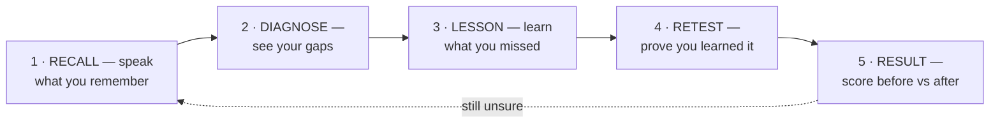

> **Trace:** recall → diagnose → lesson → retest → result (and, if unsure, back
> to recall).

Some rules that keep this simple:

- The **browser decides** when to move from one screen to the next. The server
  never pushes; it only answers requests.
- If the student didn't improve, the loop can go back to step 1 — a fresh
  recall — or loop inside step 4 (retest again) / step 3 (relearn).

---

### 5.2 Chapter ingest — putting content into the system

Before any studying can happen, a chapter must be loaded in. Ingest runs **once
per chunk** and its result (the concept checklist) is cached and reused by
every later session — it is never re-run live during a study loop.

The unit we cut and send to the AI is a **chunk**, not a chapter: one
table-of-contents section at a time (e.g. "Chapter 1 · 1.2 Reflection"), so
each Gemini extraction call reads a small, navigable piece of the book.

Two ways content gets in:

- **Seeded/demo content** — the demo (and any seeds) load chapters directly on
  the server (see [the roadmap](roadmap.md)).
- **The student's own textbook (Phase 6)** — the student uploads their book
  (PDF up to **15 MB**, or pasted text) from the app. The browser reads the
  PDF's outline (its real table of contents via pdf.js `getOutline()`) and
  slices the book along it into chunks, on the device. Only cleaned chunk
  text is POSTed to `/api/chapters/ingest` — the file bytes never leave the
  phone and the server never sees a PDF. Books without a TOC fall back to
  heading detection (`Unit 1`, `ምዕራፍ 2`, ...) then to even page runs.

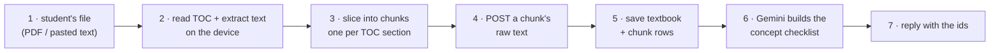

> **Trace:** file → device reads the TOC + extracts text → chunk per TOC
> section (heading/part-split fallbacks) → raw text → saved rows → Gemini
> extracts concepts → concepts saved → ids returned.

```
Sending:   { textbookTitle, subject, language, title, rawText }
Receiving: { textbookId, chapterId, conceptsExtracted, reused }
Data kept: textbook (1) → chapter/chunk (1) → concept_node (5-12)
```

That checklist is the **foundation of everything that follows**: it's what the
AI grades against, what it teaches, and what it re-tests. If the AI ever fails,
the server falls back to a deterministic extraction (sentence splitting + token
matching), so ingest never hard-fails.

---

### 5.3 Starting a study session

Here's the order when a student picks a chapter:

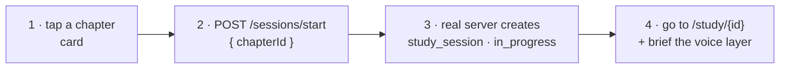

> **Trace:** pick chapter → server opens a session → return `sessionId` →
> navigate to the study screen.

```
Sending:   { chapterId }
Receiving: { sessionId }
Data kept: study_session (1 row, status = "in_progress")
```

No AI call happens here — it's just bookkeeping. All study screens for the rest
of the session use this `sessionId`.

---

### 5.4 Recall — "what do you remember?"

This is the heart of the product. The student speaks out loud; the system
grades their explanation against the concept checklist:

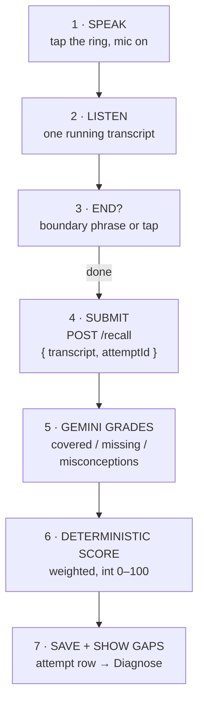

> **Trace:** speak → listen → detect the end → submit → Gemini grades →
> deterministic score → save + show gaps.
>
> **Data kept:** attempt (1 row, stage = "recall")

```
Sending:   { transcriptText, attemptId }
Receiving: { gaps: { covered: [...], missing: [...], misconceptions: [], score: 60 } }
```

A few things worth knowing:

- **What's graded:** covered (explained correctly), missing (never mentioned),
  misconceptions (stated a wrong belief). The score is a **weighted** percentage
  — higher-weight concepts count more, and stating a misconception lowers it.
- **Idempotency:** because every submission carries a random `attemptId`, a
  double-tap, a retry, or a network replay can never create a phantom second
  attempt. The dedup is scoped to the session.
- **Restore on refresh:** if the student reloads the page, the screen rebuilds
  itself from the saved attempts instead of asking the student to recall a
  second time.

**Auto-end detection** details live in section 5.12 below.

---

### 5.5 Diagnose — "here's what's missing"

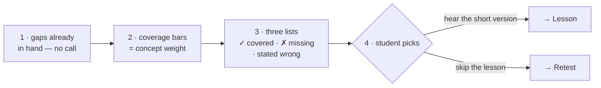

> **Trace:** gaps in hand → weighted bars → three lists → student chooses the
> path. Nothing is saved in this phase — it's a read-only screen.

---

### 5.6 Microlesson — "learn what you missed"

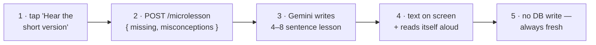

> **Trace:** tap → generate the lesson → show it → speak it. Nothing is saved;
> the lesson is always freshly generated for the specific gaps.

```
Sending:   { missing: [...], misconceptions: [...] }
Receiving: { text: "When current flows through two paths..." }
Data kept: nothing — pure AI generation
```

The read-aloud step uses the agent's natural voice when available, otherwise
the browser's TTS from the "Read it to me" button (see 5.11).

---

### 5.7 Retest — "prove you learned it"

The retest has two parts: generating questions, then grading each answer. One
design goal matters above all: **each question is graded alone against exactly
one concept**, so getting one right can't secretly help the others.

**Part A — Generate the questions:**

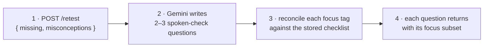

> **Trace:** ask for questions → Gemini writes them → tags are verified →
> canonical focus returned. (Case/whitespace tolerant; an unverifiable tag
> falls back to the gap list — a question never grades against a made-up idea.)

```
Sending:   { missing: [...], misconceptions: [...] }
Receiving: { questions: [ { question: "...", focus: ["..."] }, ... ] }
```

> **Echoes the student, not a canned quiz:** the question writer also receives
> the student's own recall for this session (the latest `recall` attempt, read
> server-side) and is instructed to mirror its wording — terms, framing, and
> examples — so each question reads like a follow-up to what they actually
> said. The prompt never restates a wrong belief they voiced as if it were
> correct. (`retestUserPrompt` in `apps/server/src/ai/gemini.ts`.)

**Part B — Answer each question:**

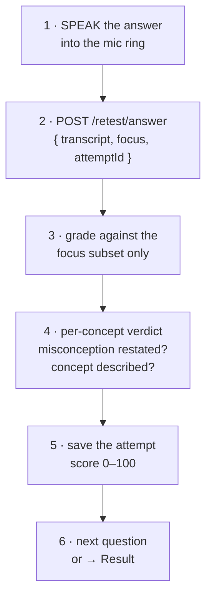

> **Trace:** speak → submit → grade the focus only → verdict → save + score →
> next question.

```
Sending:   { transcriptText, focus: ["..."], attemptId }
Receiving: { score: 100, gaps: { covered, missing, misconceptions, score } }
```

---

### 5.8 Result — "see your improvement"

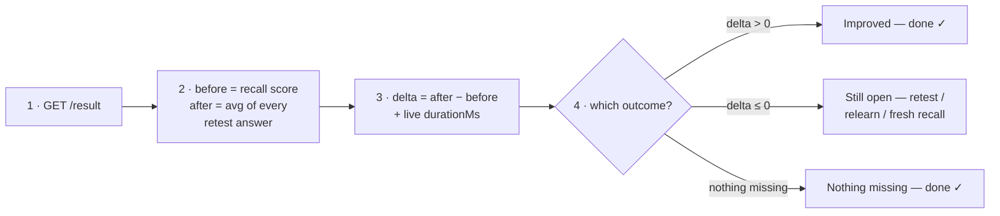

> **Trace:** fetch result → compute the metrics → pick the outcome → suggest the
> next move. After two consecutive no-improvement rounds, the app suggests
> coming back later.

```
Receiving: { before: 60, after: 85, delta: 25, durationMs: 124000 }
Data kept: nothing — reads earlier attempts
```

---

### 5.9 Session end — "I'm done"

The session ends two ways: a button tap or a spoken farewell.

**Path A — Button ("Done for now"):**

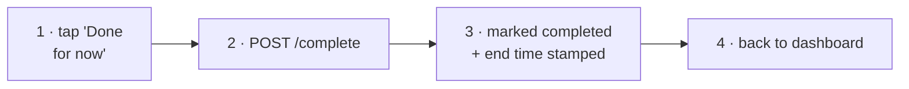

> **Trace:** tap → complete → stamp → dashboard. Unknown session ids get a
> **404**, so a stale "complete" can never blow up a fresh session.

**Path B — Spoken farewell:**

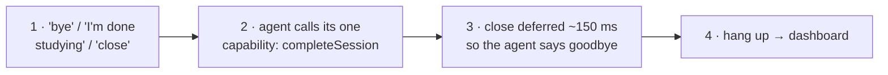

> **Trace:** hear the farewell → one tool call → speak the goodbye → leave. If
> the microphone is mid-answer (a recall being captured), the farewell is **NOT**
> treated as "end session" — it finalizes the answer instead.

```
Sending:   POST /sessions/{id}/complete
Receiving: { ok: true, durationMs: 53659 }
Data kept: study_session UPDATE (status = "completed", completedAt = now)
```

---

### 5.10 Voice agent — a single-job assistant

The voice agent (Voxide) is a conversational assistant that knows **what** the
student is studying (the subject, chapter, and current step) but not the lesson
content or the score breakdown — that detailed thinking stays with Gemini, the
grader. Its only *action* is closing the session.

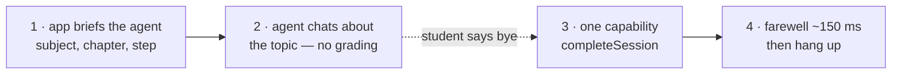

> **Trace:** brief the agent → chat (topic only) → farewell heard → one
> capability → hang up.

Why exactly one capability? Because one source of truth is easier than two.
Everything that *grades* — the recall, the retest answers, the lessons — is
driven by the on-screen loop, so the agent can never create a duplicate attempt
or get out of sync with what's on the screen.

---

### 5.11 Natural voice read-back — replacing robotic TTS

When a lesson arrives it reads itself aloud so the student can follow both the
text and the voice:

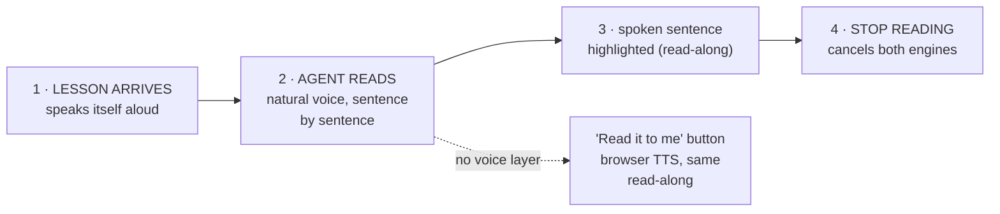

> **Trace:** lesson → natural read → highlight → stop on demand. The browser
> voice is never automatic — it only runs from the explicit button, and a read
> is cut off if the student leaves the screen mid-sentence.

The browser voice (`speakAloud`) picks the least robotic English voice
available and reads at a slightly relaxed pace. A safety beat also keeps it
alive through Chrome's known "paused speech" stall, so a long lesson never
stops mid-sentence.

---

### 5.12 End-of-speech detection — auto-submit without a tap

While the student speaks, the browser watches their transcript for boundary
phrases:

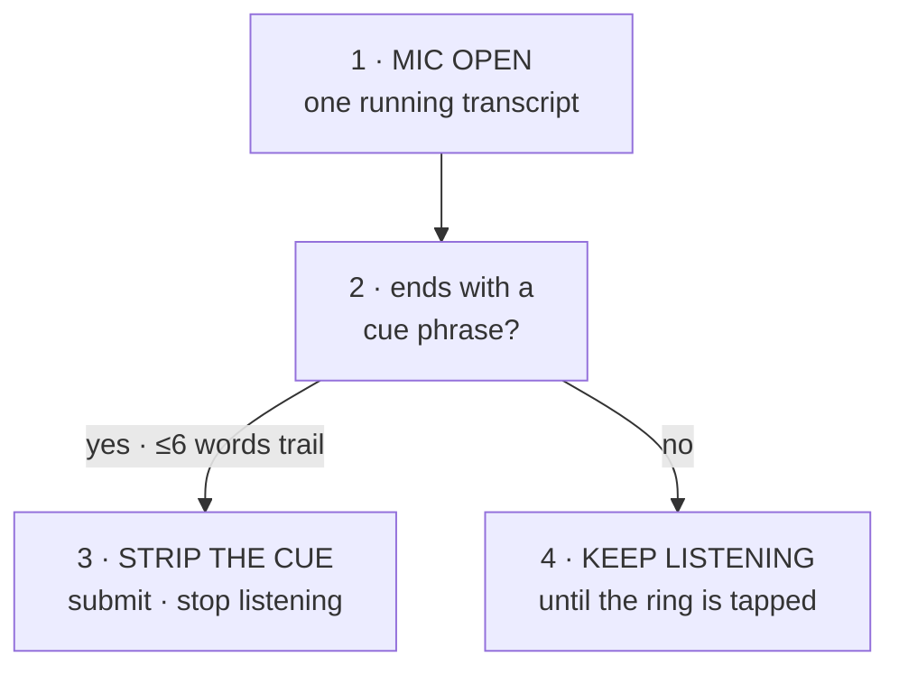

> **Trace:** listen → check for the cue → either submit or keep listening. The
> submitted text is the student's answer; the cue phrase itself is removed
> before submission. (16 cues total — "that's all I remember", "I'm done", "next
> question", ... — defined in `apps/web/src/lib/intent.ts`.)

---

### 5.13 The database — what gets saved

The study domain uses **five tables**, and one row of each means:

| Table | One row = | Key columns |
|---|---|---|
| `textbook` | A real textbook that **belongs to a user** (e.g. "Physics") | `ownerId` (→ user), `title`, `subject`, `language` |
| `chapter` | One chapter in a textbook, with its text | `textbookId`, `title`, `rawText` |
| `concept_node` | One idea (or misconception) in the checklist | `chapterId`, `conceptText`, `isMisconception`, `weight` |
| `study_session` | One study attempt on a chapter | `chapterId`, `userId` (→ user), `status`, `startedAt`, `completedAt`, `retestQuestions` (JSON), `retestIndex` |
| `attempt` | One measurement inside a session: the recall, or one retest answer | `id` (client `attemptId`), `sessionId`, `stage`, `transcriptText`, `gapsIdentified` (JSON), `score` |

*Why `retestQuestions` and `retestIndex` exist:* if the student reloads
mid-retest, the server can rebuild the exact question they were on and restore
their answered list — instead of dumping them back into a cold recall. Auth
adds four more tables (`user`, `session`, `account`, `verification`) — see [the database sector](database.md).

What each action writes:

- **Chapter ingest** → `textbook` (1) + `chapter` (1) + `concept_node` (5–12)
- **Start session** → `study_session` (1)
- **Recall** → `attempt` (1, stage `"recall"`)
- **Retest answer** → `attempt` (1, stage `"retest"`)
- **Complete** → `study_session` UPDATE (status, completedAt)
- **Microlesson, retest questions, result, history** → nothing (pure AI
  generation or reads)

---

### 5.14 AI prompts — what gets sent to Gemini

Every AI call follows the same shape: one system prompt plus the student's
data, sent as a single message with `temperature: 0.4` and JSON output. Five
different things get asked:

1. **EXTRACT** (chapter ingest) — "Pull the core concepts + common
   misconceptions from this chapter" → `{items: [{conceptText, weight,
   isMisconception}]}`.
2. **GRADE** (recall + retest) — "Judge how well the student's explanation
   covers the checklist" → `{covered: [], missing: [], misconceptions: [],
   score}`.
3. **LESSON** (microlesson) — "Write a short, pronunciation-friendly lesson
   that fixes exactly these gaps" → `{text}`.
4. **RETEST** (retest questions) — "Write 2–3 spoken-check questions that
   re-test the missing concepts; tag each with the targetConcept it tests;
   if the student's own recall is provided, mirror its wording" →
   `{questions: [{question, targetConcept}]}`.
5. **FOCUS** (per-question verdict) — a deterministic helper, not a prompt: a
   misconception counts as handled when *not* restated; a real concept counts
   when covered. Applied to the question's focus subset only.

Grading never trusts the AI's raw float: every score is recomputed
deterministically server-side using the concept weights. And every prompt has a
fallback — if Gemini fails or the key is a placeholder, deterministic
heuristics take over (token matching for grading, sentence splitting for
concepts, templates for lessons/questions).

---

### 5.15 Complete data flow map — every request

Every API request in the product, who makes it, and whether it touches the AI
or the database. **All of these require a signed-in session** — see [authentication](auth.md) for how
that works:

| Endpoint | Called by | AI? | DB write? |
|---|---|---|---|
| `POST /api/auth/*` | Sign-in / sign-up / session | no | yes (auth tables) |
| `GET /api/chapters` | Dashboard | no | no |
| `GET /api/chapters/:id/concepts` | (view only) | no | no |
| `POST /api/chapters/ingest` | Admin / seed | yes | yes |
| `POST /api/sessions/start` | Dashboard | no | yes |
| `GET /api/sessions` | Dashboard (history) | no | no |
| `GET /api/sessions/:id` | StudyProvider | no | no |
| `POST /api/sessions/:id/recall` | StudyProvider | yes | yes |
| `POST /api/sessions/:id/microlesson` | StudyProvider | yes | no |
| `POST /api/sessions/:id/retest` | StudyProvider | yes | no |
| `POST /api/sessions/:id/retest/answer` | StudyProvider | yes | yes |
| `GET /api/sessions/:id/result` | StudyProvider | no | no |
| `POST /api/sessions/:id/complete` | UI + voice agent | no | yes (update) |

The key insight: **the browser UI owns the whole study loop.** The only thing
the voice agent can do is `completeSession` — one endpoint, one job. The
server doesn't care who sent the request.

---

