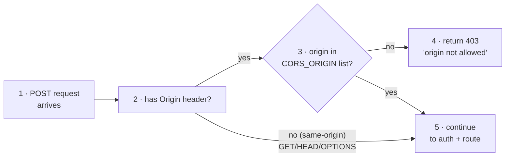

# How Kiftet Works — security, trust, and guards

> Part of the [how-it-works index](README.md).

## How the browser and server trust each other — CORS, CSRF, origin

When a browser sends a request to a *different* origin (domain or port) the
server must explicitly decide whether to trust it. This is **CORS** (Cross-Origin
Resource Sharing).

### 9.1 CORS_ORIGIN — the trusted origin

Every server deploy sets one environment variable for this: `CORS_ORIGIN`. This
is the **single origin** the server trusts for state-changing requests (POST,
PUT, DELETE). During build or config this value is normalized:

```
https://app.example.com/  →  https://app.example.com   (trailing slash stripped)
https://app.example.com,http://localhost:3000           (comma-separated = multiple)
```

This normalized list is fed to both the Express `cors` middleware (for the
`Access-Control-Allow-Origin` header) and to Better Auth's `trustedOrigins`.

### 9.2 Preflight — the OPTIONS request

Before the browser sends a POST to a cross-origin server, it sends an `OPTIONS`
request ("preflight") to ask permission. The server's CORS config replies:

```
Access-Control-Allow-Origin: https://app.example.com
Access-Control-Allow-Methods: GET, POST, OPTIONS
Access-Control-Allow-Headers: Content-Type, Authorization
Access-Control-Allow-Credentials: true
```

If the origin doesn't match any in the configured list, the server replies with
no `Access-Control-Allow-Origin` header, and the browser blocks the request
entirely — cookies never travel.

### 9.3 Why `credentials: "include"` matters

By default, browsers don't send cookies cross-origin. Adding `credentials:
"include"` to the fetch options tells the browser: "yes, attach cookies even
though the origin is different." The server must then reply with
`Access-Control-Allow-Credentials: true` — otherwise the browser still blocks
the cookie.

### 9.4 Origin check on writes (extra protection beyond CORS)

CORS protects the **browser**. But a direct curl or a script that ignores CORS
could still POST to the server. That's why `requireAuth` (see [authentication](auth.md)) does an
**additional origin check** on every non-GET request:



This catches a class of CSRF (Cross-Site Request Forgery) attack where a
malicious site tricks a logged-in user's browser into POSTing data to our
server. The origin header the browser sends (if any) won't match our list.

### 9.5 What `sameSite: "none"` means for the cookie

`samesite: none` means the session cookie is sent with **any** cross-origin
request — which is exactly what we need for the React app talking to the API on
a different origin. The cost: `samesite: none` also allows the cookie in
third-party embeds. We mitigate this by requiring HTTPS (`secure: true`) and
rejecting any non-trusted origin in the middleware.

---

## Policies, limits, and guards

These are the invisible walls that keep the product from being misused or
overloaded. Every one of them is applied server-side; the client is never trusted
to police itself.

### 10.1 Ownership / tenant isolation

**Principle:** a user can only see their own data.

Every query that returns chapters, concepts, sessions, or results filters by
the signed-in user's `userId`. The chapter ingest path stamps the new textbook
with `owner_id = currentUser`. When a session starts, the server verifies that
the requested `chapterId` belongs to a textbook owned by that user — returning
`404` otherwise. Two students sharing a login would still only see one set of
chapters; two separate accounts see nothing of each other.

### 10.2 AI rate limiting (in-memory)

Every AI-grading call (`recall`, `microlesson`, `retest`, `retest/answer`) and
chapter ingest is rate-limited per user per minute, tracked in an in-memory
`Map`:

- **Demo visitors:** **5 requests / minute** — enough to feel the product,
  stingy enough to protect the Gemini budget. The client shows this as a
  live "AI calls left this minute" pill (`GET /api/ai/budget`).
- **Signed-in users:** **30 requests / minute** today; the number exists only
  as a safety net and gets much larger before launch (see the go-live note in
  (see the go-live note in [the roadmap](roadmap.md)).

When the limit is hit the server returns `429 Too Many Requests` with a
friendly message.

**Demo daily book cap:** demo visitors may create at most **3 new textbooks
per day** (re-ingesting chunks of an existing book doesn't count). Signed-in
users are not capped.

**Demo identity is DB-backed:** an anonymous visit is authenticated by an
`X-Demo-User-Id` header, and the header is trusted only when it resolves to a
real user row with a `@demo.kiftet` email (created by `/demo/start`). Because
that check is a database lookup rather than a memory set, a demo visitor
survives server restarts and multi-instance deploys. `/demo/start` — the one
endpoint a stranger may call — is throttled to **5 identity creations per
minute per IP**.

**Error handling:** the API answers every failure as JSON `{ error: "…" }` with
copy written for the student, never an HTML stack page. Express's async
rejections and sync throws all land in one error middleware
(`apps/server/src/error-handler.ts`), which also gives oversized bodies a
friendly `413`. The web client timeouts a hung request at 30s and translates
offline / abort failures into "Can't reach Kiftet" messages instead of raw
`TypeError: Failed to fetch`.

This is the *only* rate limiter; plain reads (chapters, sessions, results) are
unlimited. The per-minute AI window is in-memory, so the counters reset on
server restart — this is a safety net, not a billing system (DB-backed quotas
are the go-live upgrade in [the roadmap](roadmap.md)).

### 10.3 Request size limits

The server rejects HTTP request bodies larger than **256 KB**
(`express.json({ limit: '256kb' })`). On the client, textbook PDFs are capped
at **15 MB** (a file-size guard before any extraction) and each chunk's text
is split to stay under the server's **200,000-character** ingest cap.
Transcript submissions are individually capped at **20,000 characters** via
Zod validation, and concept text is capped at **500 characters**. These
prevent accidental upload of an entire textbook or a pathological prompt.

### 10.4 Idempotency — no phantom duplicates

Every submission carries a **client-generated `attemptId`** (a random UUID). The
server calls `INSERT ... ON CONFLICT DO NOTHING` — if a network retry sends the
same attempt twice, the duplicate is silently dropped and the first score is
returned. The dedup is scoped to the session, so different sessions can have the
same `attemptId` without conflict.

Chunk ingest is idempotent a second way: a chunk whose title already exists
under the same textbook is answered with `reused: true` and its existing
`chapterId` — **zero** AI spent — which is also what makes a half-finished
import a free resume.

### 10.5 Retest ordering

The server tracks `study_session.retestIndex` — the ordinal of the next
unanswered retest question. If a client sends an answer for question 3 when
question 2 is still open, the server rejects it with `409 Conflict`. This keeps
the grading pipeline strict and prevents clients from submitting answers out of
order after a page reload.

### 10.6 Env-based mode switching

| Variable | Effect |
|---|---|
| `NODE_ENV=development` | Verbose errors, relaxed cookie policy |
| `NODE_ENV=production` | HTTPS-only cookies, no stack traces in error responses |
| `VITE_SERVER_URL` not set in production | loud console.error on client, API calls fail visibly |
| `CORS_ORIGIN` wrong or missing | every login silently fails (cookie never attaches) |

---

